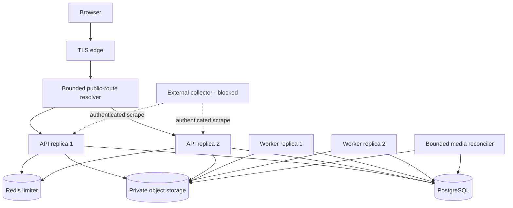
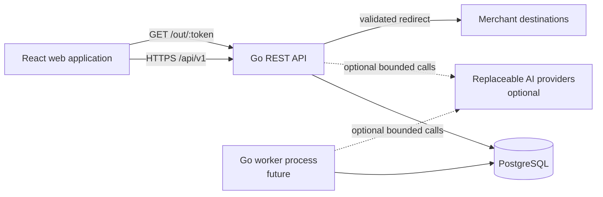
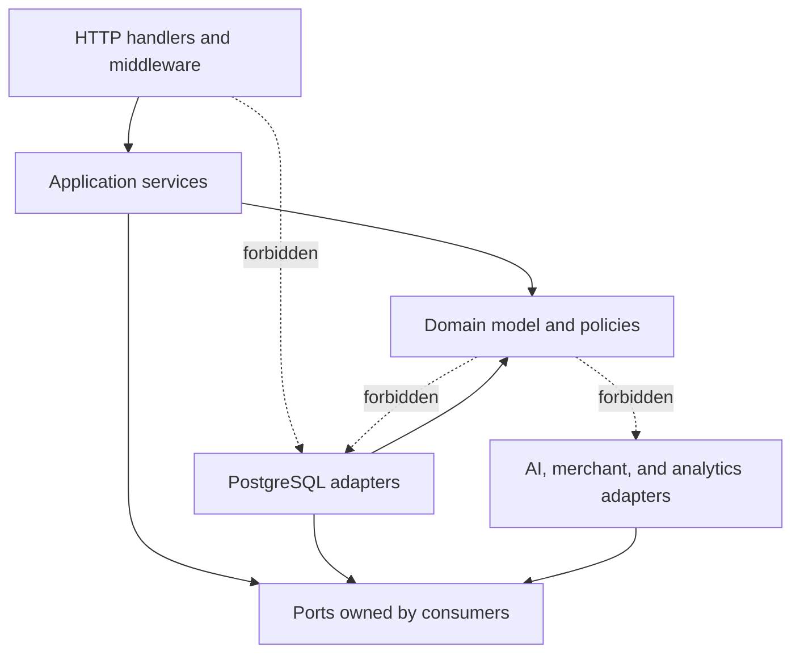
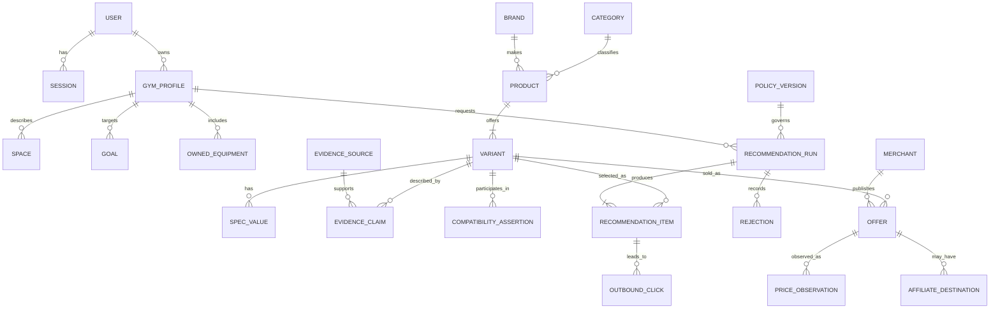
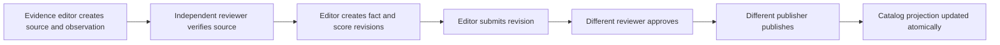
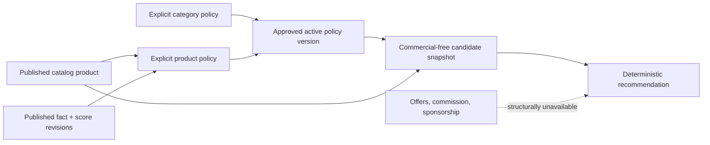
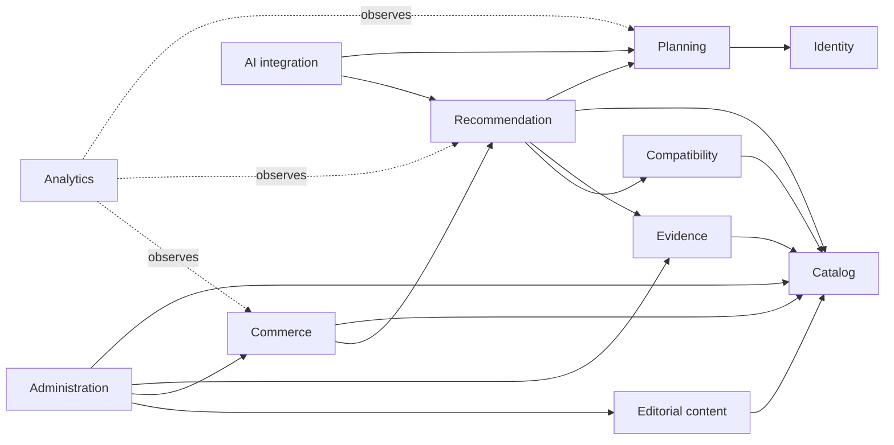
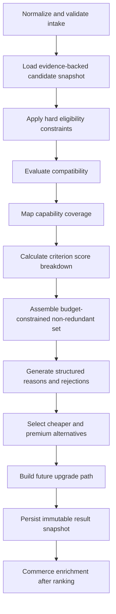
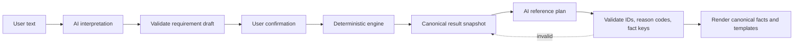
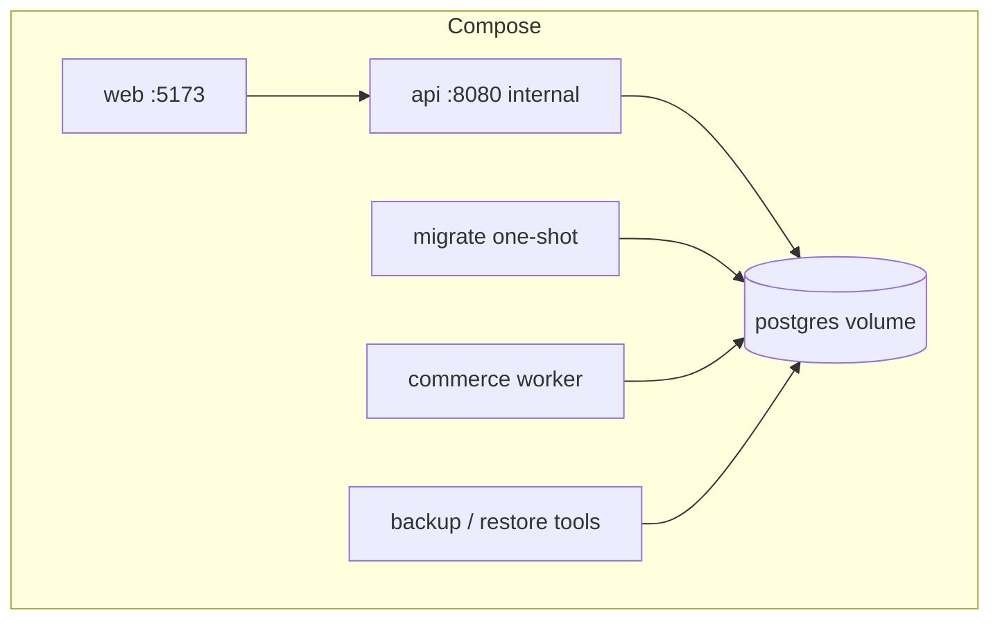

# UNSOLERO Technical Architecture

Status: approved architecture with incremental implementation status  
Scope: target architecture with implemented sections called out explicitly  
Last reviewed: 2026-08-18

This document is the architectural source of truth for UNSOLERO. It supersedes the Phase 1 sketch that was in `docs/architecture.md`, now reduced to a stub pointing here. The current repository implements the consumer and admin web surfaces, API and health checks, the core relational model, PostgreSQL adapters, opaque-session authentication, deterministic recommendations, provider-neutral merchant ingestion and affiliate operations, first-party analytics, and the provider-neutral AI boundary described below.

## Phase 11 operational edge

Phase 11 preserves the modular monolith and adds operational adapters rather
than new business domains. Public browser routes pass through a bounded route
resolver before the edge serves the SPA. Operational metrics combine bounded
replica-local counters/pool state with durable cross-process queue, import,
media, backup, and restore state from PostgreSQL. Media inventory remains an
admin application service behind database and object-inventory ports.



The route resolver exposes no account or product payload and cannot capture
`/api`, assets, media, sitemap, or robots locations. The recommendation module
still has no commerce/analytics/AI dependency; none of the new operational
metrics or reconciliation inputs can enter recommendation scoring.

## 0. Architectural position

UNSOLERO is a trusted decision engine, not a generic chatbot, advertising directory, or merchant storefront. Its core responsibility is to produce reproducible, evidence-backed product decisions from a user's goals and constraints. The product domain is selected per deployment; the engine holds no vertical-specific vocabulary.

The initial system will be a **modular monolith**:

- one React web application;
- one Go codebase, initially deployed as an API process and later optionally as a worker process;
- one PostgreSQL database with ownership divided by logical schemas;
- explicit domain, application, port, and adapter boundaries inside the codebase.

This is deliberate. A modular monolith preserves transactions and operational simplicity while the product model is evolving. The module contracts are designed so that a high-load or independently governed module can be extracted later without rewriting the domain.

### Non-negotiable dependency rules

1. UI components do not contain recommendation, pricing, authentication, or attribution policy.
2. HTTP handlers decode, validate, authorize, call an application service, and encode a response. They do not query PostgreSQL.
3. Application services coordinate use cases and transactions. They do not know HTTP details.
4. Domain packages contain invariants and policies. They do not import HTTP, PostgreSQL, analytics vendors, affiliate providers, or AI SDKs.
5. Repository interfaces are defined on the consuming side; PostgreSQL implementations depend on those interfaces, not the reverse.
6. The recommendation engine cannot import or receive affiliate commission data.
7. Commerce enriches a completed recommendation; it never changes objective product rank.
8. AI is an optional adapter behind narrow interfaces. Deterministic product decisions continue to work when every AI provider is unavailable.
9. Analytics failure never blocks the primary user action, except for durable legal or financial audit records explicitly designated as transactional.
10. Configuration is injected at composition roots and does not leak into domain code.



## 1. Frontend folder structure

The frontend is feature-oriented. Shared presentation primitives remain independent from feature behavior, while each feature owns its API calls, schemas, view models, hooks, and feature-specific components.

```text
frontend/
├── public/
│   ├── images/
│   ├── robots.txt
│   └── site.webmanifest
├── src/
│   ├── app/
│   │   ├── App.tsx                 # application shell only
│   │   ├── router.tsx              # route definitions and lazy boundaries
│   │   ├── queryClient.ts          # TanStack Query defaults
│   │   ├── providers.tsx           # composition of global providers
│   │   └── errorBoundary.tsx
│   ├── routes/
│   │   ├── public/                 # SEO-visible landing/editorial routes
│   │   ├── builder/                # intake and recommendation result routes
│   │   ├── account/                # authenticated consumer routes
│   │   └── admin/                  # lazy-loaded, staff-authorized routes
│   ├── features/
│   │   ├── auth/
│   │   ├── catalog/
│   │   ├── gym-profile/
│   │   ├── recommendations/
│   │   ├── saved-plans/
│   │   ├── commerce/
│   │   └── analytics-consent/
│   │       ├── api/                # HTTP functions and query keys
│   │       ├── components/         # feature presentation
│   │       ├── hooks/              # orchestration and derived view state
│   │       ├── model/              # frontend-only state and view models
│   │       ├── schemas/            # Zod request/response/form schemas
│   │       └── tests/
│   ├── components/
│   │   ├── ui/                     # accessible design-system primitives
│   │   ├── layout/
│   │   └── feedback/               # loading, empty, error, success states
│   ├── lib/
│   │   ├── api/                    # fetch client, error mapping, request IDs
│   │   ├── auth/                   # session helpers, never credential policy
│   │   ├── money/
│   │   ├── measurement/
│   │   └── accessibility/
│   ├── config/                     # validated public runtime configuration
│   ├── styles/                     # tokens and global styles
│   ├── test/                       # render helpers and API fakes
│   └── main.tsx
├── e2e/                            # Playwright browser and Axe regression paths
└── package.json
```

### Frontend responsibilities

- Route components assemble feature components; they do not implement policies.
- TanStack Query owns server state, caching, invalidation, and asynchronous status.
- React Hook Form owns form state; Zod validates at the user-input and API boundaries.
- Hooks translate API resources into view state. Shared business decisions remain authoritative on the server.
- Every server-backed surface renders explicit loading, empty, error, and success states.
- Public editorial and catalog pages receive crawlable metadata, canonical URLs, semantic headings, and structured data only when supported by real product data.
- Admin routes are code-split and authorization-gated, but backend authorization remains authoritative.
- Design-system primitives expose accessibility behavior rather than forcing each feature to recreate it.

The frontend may calculate harmless display values, such as formatting currency or dimensions. It must not calculate authoritative eligibility, recommendation scores, discounts, affiliate attribution, or permissions.

## 2. Backend folder structure

The backend uses feature modules with dependency inversion. Interfaces live next to the application or domain code that consumes them; infrastructure implementations live under adapters.

```text
backend/
├── cmd/
│   ├── api/                         # API composition root
│   ├── worker/                      # outbox/import/AI jobs; added when needed
│   └── migrate/                     # explicit migration entry point
├── internal/
│   ├── app/
│   │   ├── api.go                   # dependency wiring and lifecycle
│   │   └── worker.go
│   ├── modules/
│   │   ├── identity/                 # each module uses the shape below
│   │   ├── planning/
│   │   ├── catalog/
│   │   ├── evidence/
│   │   ├── compatibility/
│   │   ├── recommendation/
│   │   ├── commerce/
│   │   ├── analytics/
│   │   └── administration/
│   ├── transport/
│   │   └── http/
│   │       ├── middleware/
│   │       ├── public/
│   │       ├── account/
│   │       ├── admin/
│   │       ├── response/
│   │       └── router.go
│   ├── adapters/
│   │   ├── postgres/                # repository implementations by module
│   │   ├── auth/                    # token generation, password/passkey adapters
│   │   ├── ai/                      # provider-specific implementations
│   │   ├── analytics/               # optional exporter implementations
│   │   ├── merchant/                # feed/import destination adapters
│   │   └── clock/                   # real clock implementation
│   └── platform/
│       ├── config/
│       ├── database/
│       ├── logging/
│       ├── requestid/
│       ├── jobs/
│       └── shutdown/
├── migrations/
├── testdata/
├── Dockerfile
└── go.mod
```

Each module is shaped as follows when all three layers are needed:

```text
<module>/
├── domain/                           # entities, value objects, invariants
├── application/                      # commands, queries, use-case services
└── ports/                            # repository/provider interfaces
```

Not every directory should be created immediately. A directory appears only with its first real use case.

### Backend dependency direction



Handlers receive purpose-built application interfaces rather than concrete service structs where useful for testing. Transaction boundaries belong to application services. A transaction manager may be exposed as a narrow port; repositories must be able to participate in the supplied transaction without exposing `pgx` types to the application layer.

## 3. Database architecture

PostgreSQL is the transactional source of truth. One physical database is sufficient initially; logical schemas express ownership and make future extraction clearer.

### Logical schemas and ownership

| Schema | Owns |
| --- | --- |
| `identity` | users, verified contact methods, secure sessions, roles, grants |
| `planning` | gym profiles, spaces, goals, constraints, owned equipment |
| `catalog` | brands, categories, canonical products, variants, specifications |
| `editorial` | authors, reviewed content entries, curated catalog and content relationships |
| `evidence` | sources, observations, claims, provenance, review state |
| `compatibility` | interfaces, requirements, assertions, rule versions |
| `recommendation` | policy versions, run snapshots, results, scores, rejections |
| `commerce` | merchants, offers, price observations, affiliate destinations, sponsorships, clicks |
| `analytics` | consent state, allowlisted product events, aggregate checkpoints |
| `administration` | editorial workflow, import jobs, audit log |
| `platform` | transactional outbox, idempotency records, job leases |

Database roles should enforce least privilege in deployed environments. The API role receives only the statements required for online requests; migration and reporting roles are separate.

### Core data model



### Modeling rules

- Canonical products and purchasable variants are distinct. Recommendations normally select a variant, not a marketing family.
- Money is stored as integer minor units plus ISO currency. Floating-point money is prohibited.
- A product's compared price carries its billing basis. `catalog.products.price_minor` is the figure the recommendation engine, budget filters and alternatives compare, and `billing_period`, `pricing_unit`, `pricing_unit_note` and `annual_price_minor` say what it is a price for. The site rule is that the compared price is the monthly-billing list price wherever the vendor sells monthly; when `billing_period` is `annual` the vendor offers no monthly billing and `price_minor` is the per-month equivalent of an annual contract; `free` means the entry tier is free and `price_minor` is 0; `usage` means the price is usage-based and `price_minor` is the entry figure or 0, with the note explaining. The per-month annual-billing equivalent a vendor quotes beside a monthly price is stored separately in `annual_price_minor` and is displayed, never compared. The engine reads `price_minor` alone and needs no knowledge of the basis. `evidence.product_fact_revisions` carries the same four columns as nullable revision fields; a revision restates the basis whole or not at all, and publication leaves the product's basis untouched when the revision carries none.
- Physical measurements are normalized to documented base units while retaining source values and units for provenance.
- Common searchable fields are relational columns. Category-specific specifications use typed definitions and typed value columns, not an unvalidated EAV string table.
- Raw merchant or manufacturer payloads may be retained in JSONB for audit/reprocessing, but domain decisions use validated normalized facts.
- Every recommendation-relevant claim links to evidence, capture time, review status, and confidence. Conflicting claims remain representable.
- Prices are observations with region, condition, shipping assumptions, availability, and capture time; they are not overwritten as timeless product properties.
- Soft deletion is reserved for records that require audit history. Published catalog facts are versioned or withdrawn, not silently mutated.
- User deletion uses a documented anonymization/deletion workflow and removes authentication secrets immediately.
- Timestamps are UTC `timestamptz`; presentation converts to user locale.
- Public identifiers are opaque UUIDs. Internal ordering must not be inferred from them.

### Migrations and transactions

- Migrations are immutable, ordered SQL files with explicit up behavior; destructive changes use expand/migrate/contract releases.
- Migrations run as a deployment job, not independently on every API replica.
- CI applies every migration to an empty database and tests upgrade from the latest supported release snapshot.
- Cross-module writes happen only through an application use case. When durable downstream work is required, the use case writes a `platform.outbox` row in the same transaction.
- The initial outbox is polled with PostgreSQL leasing (`FOR UPDATE SKIP LOCKED`). A broker is introduced only when measured throughput or delivery requirements justify it.
- Backups, restore drills, retention, and point-in-time recovery are deployment requirements before production data is accepted.

## 4. Domain boundaries

| Module | Responsibility | Owns decisions about | Must not know |
| --- | --- | --- | --- |
| Identity | Accounts, sessions, roles | authentication state and grants | product scoring, affiliate economics |
| Planning | User goals and physical constraints | normalized intake and owned equipment | merchant commission, AI providers |
| Catalog | Canonical equipment model | product identity and normalized specifications | user identity, recommendation rank |
| Editorial content | Reviewed acquisition content and curated links | publication-safe blocks, canonical routes, related reading | product price truth, recommendation rank, affiliate commission |
| Evidence | Source provenance and review | whether a fact is supported/publishable | affiliate value |
| Compatibility | Physical and functional fit | interfaces, requirements, compatibility outcomes | sponsorships, HTTP |
| Recommendation | Eligibility, scoring, set assembly | objective results, rejections, alternatives, upgrade paths | commission, affiliate URLs, AI SDKs |
| Commerce | Offers and outbound destinations | current offer eligibility and safe redirect resolution | changing recommendation scores |
| Analytics | Consent-aware product telemetry | accepted event schemas and retention | authorization or ranking decisions |
| Administration | Staff workflows | review/publish/import operations | bypassing domain invariants |
| AI integration | Optional interpretation and drafting | provider selection and validated structured output | authoritative product facts or rank |

### Implemented evidence trust boundary

Phase 1 implements the evidence boundary as a first-class module with domain,
application, repository-port, PostgreSQL-adapter, transport, and admin-inspection
layers. `evidence.sources` classifies manufacturer documentation, independent
testing, verified merchant observations, editorial assessments, and explicitly
fictional development fixtures. Dated observations carry freshness and
confidence. Product fact and score revisions are immutable records with
per-field provenance, per-score rationale, reviewer identity, workflow state,
and append-only audit events.

Publication is a transaction, not a status toggle:



The public catalog queries only products whose fact and score revision pointers
resolve to published, fresh revisions. Draft, in-review, approved-but-unpublished,
rejected, expired, or ungoverned data therefore fails closed. Published product
projections cannot be edited through the ordinary admin product editor; changes
must be represented by a new evidence revision. The API roles
`evidence_editor` and `evidence_reviewer` are distinct from the read-only admin
inspection permission, and repositories enforce author/reviewer/publisher
separation of duties.

The gate is continuously re-evaluated. If a linked source is withdrawn or an
observation expires after publication, the product immediately disappears from
public catalog and recommendation candidate reads. Its projection remains only
for audit and historical replay.

AI has no import path or repository capability into this module. Model output
can be used by a human as drafting input, but only authenticated evidence roles
can create, review, and publish canonical records.

### Implemented data-driven recommendation policy boundary

Phase 2 removes category-slug behavior from production recommendation code.
`recommendation.policy_versions` owns a reviewed configuration graph:
supported categories, extensible capability keys, product requirements,
compatibility and incompatibility relations, goal support, setup roles,
redundancy groups, preference tags, and evidence-revision-bound spatial
profiles. A catalog category or product is excluded until the active policy
explicitly supports it and binds the product's current published fact and score
revisions. Unknown data therefore fails closed instead of receiving inferred
defaults.



Policy activation uses separate `policy_editor` and `policy_reviewer` roles,
repository-enforced author/reviewer/activator separation, completeness checks,
and an admin audit record. Active policy definitions are database-immutable;
changes require a new version. Retired policy behavior remains immutable while
referenced by a recommendation. Completed runs snapshot the active policy
version, all candidate capabilities and relations, goal scores, spatial inputs,
and policy-enriched existing-equipment capabilities. The original engine
version and fingerprint remain part of the decision record.

The space model distinguishes known values from missing values. Base footprint
is mandatory for an eligible product. Storage footprint, operating clearance,
safety clearance, minimum room height, access width, and overlap groups are
optional evidence-backed policy data. A category can mark an optional class as
required; a missing required measurement rejects the product explicitly.
Overlap reduces combined floor use only when the policy assigns the same
non-empty overlap group.

Capability and relation keys are normalized data, not a closed Go enum. The
fitness launch policy is `fitness-v2`, but the engine consumes generic roles,
capabilities, requirements, support scores, and redundancy groups. New product
categories therefore require reviewed category/product policy data and evidence,
not a category switch in the engine. New user-goal or intake concepts can still
require planning and frontend contract work; Phase 2 does not pretend those
future verticals already exist.

### Allowed high-level dependencies



Dashed analytics edges represent event observation, not synchronous domain dependencies. Administration calls the same application services and invariants as public workflows; it does not write tables directly.

## 5. API structure

The REST API is versioned under `/api/v1`. Resources use nouns, JSON, opaque IDs, and consistent envelopes. `/out/:token` is intentionally outside the API namespace because it is a browser redirect surface.

### Proposed resources

```text
GET    /api/v1/health/live
GET    /api/v1/health/ready

POST   /api/v1/auth/registrations
POST   /api/v1/auth/sessions
DELETE /api/v1/auth/session
POST   /api/v1/auth/email-verifications
POST   /api/v1/auth/password-resets
GET    /api/v1/me

GET    /api/v1/catalog/categories
GET    /api/v1/catalog/products
GET    /api/v1/catalog/products/:productID

GET    /api/content?section=articles|guides|comparisons|stacks|all
GET    /api/content/:slug
GET    /sitemap.xml
GET    /robots.txt

GET    /api/v1/gym-profiles
POST   /api/v1/gym-profiles
GET    /api/v1/gym-profiles/:profileID
PATCH  /api/v1/gym-profiles/:profileID
PUT    /api/v1/gym-profiles/:profileID/owned-equipment

POST   /api/v1/recommendation-runs
GET    /api/v1/recommendation-runs/:runID
POST   /api/v1/recommendation-runs/:runID/save

POST   /api/v1/analytics/events
GET    /out/:token

GET    /api/v1/admin/catalog/products
POST   /api/v1/admin/catalog/products
POST   /api/v1/admin/catalog/products/:productID/revisions
POST   /api/v1/admin/catalog/revisions/:revisionID/publish
POST   /api/v1/admin/import-jobs
GET    /api/v1/admin/import-jobs/:jobID
GET    /api/v1/admin/audit-events
```

These paths describe the contract shape, not features that currently exist.

The unversioned editorial discovery routes above are implemented public-read contracts. They expose only published, validated content and catalog-backed related products. Sitemap and robots responses are generated by the backend so publication state and canonical URLs share one source of truth. They can move under a versioned API later without changing public page URLs.

### API conventions

- Request and response schemas are explicit DTOs; domain entities are never serialized directly.
- Handlers reject unknown JSON fields, enforce body limits, validate content types, and return safe errors.
- Validation exists twice by design: transport validation for usable feedback and domain validation for invariants.
- Errors use a stable shape:

  ```json
  {
    "error": {
      "code": "budget_out_of_range",
      "message": "The supplied budget is outside the supported range.",
      "fields": { "budget": "Must be greater than zero." },
      "request_id": "opaque-id"
    }
  }
  ```

- Cursor pagination is used for mutable or large collections; offsets are acceptable only for bounded admin tables.
- `Idempotency-Key` is required for costly or retry-sensitive commands such as recommendation creation and imports.
- Recommendation creation returns a run resource. It may return `201` when completed synchronously or `202` when queued without changing the result contract.
- Conditional GETs and ETags should be used for public catalog resources once stable.
- Request IDs propagate through logs and outbox events.
- Rate limits are stricter for authentication, recommendation generation, AI-assisted parsing, analytics ingestion, and outbound redirects.
- OpenAPI should become the contract artifact when feature endpoints begin; generated types may be consumed by the frontend, while domain types remain handwritten.

## 6. Authentication architecture

The consumer web application should use **opaque secure server sessions**, not browser-stored bearer JWTs.

Implementation status: password registration/login/logout, hashed one-time email verification and reset tokens, authenticated password change, session inventory/revocation/cleanup, structured account export, anonymizing deletion, encrypted TOTP, hashed single-use recovery codes, MFA login, recent step-up, immutable security events, and backend permission gates are implemented. OAuth/OpenID Connect remains a replaceable future credential adapter. A live email adapter is intentionally not linked without provider credentials.

### Session design

- The browser receives a high-entropy opaque token in a `Secure`, `HttpOnly`, `SameSite=Lax`, path-scoped cookie.
- Only a one-way hash of the session token is stored in `identity.sessions`.
- Sessions have absolute and idle expirations, device metadata kept to the minimum needed for security, and explicit revocation timestamps.
- Every login creates a new session ID. Password reset revokes all sessions; authenticated password change keeps the current response-bearing session and revokes every other session. Privilege membership is resolved from PostgreSQL on every request rather than embedded in the session.
- State-changing requests require exact-origin/Fetch-Metadata checks in addition to SameSite cookie policy. The same-origin SPA does not use a separately readable CSRF token.
- Authentication responses use `Cache-Control: no-store` and never expose secret material to analytics or logs.
- Guest users receive a separate short-lived anonymous planning session that can be claimed after registration without merging unrelated identities.

```mermaid
sequenceDiagram
    participant B as Browser
    participant H as Auth handler
    participant S as Identity service
    participant R as Session repository

    B->>H: POST /api/auth/login + credentials + origin context
    H->>S: Authenticate(command)
    S->>S: Verify credential and account state
    S->>R: Store a new session token hash
    R-->>S: Session metadata
    S-->>H: Opaque raw token once
    H-->>B: Set-Cookie Secure; HttpOnly; SameSite=Lax
    B->>H: Authenticated request + cookie
    H->>R: Resolve token hash
    R-->>H: User and grants
```

If password authentication is offered, passwords use a current memory-hard password hash with centrally configurable cost and automatic rehash on login. Email verification and reset tokens are random, single-use, short-lived, and stored hashed. Passkeys or external OpenID Connect providers can be added as credential adapters without changing session semantics.

### Authorization

- Application services receive an authenticated principal and enforce ownership or role policy.
- Consumer ownership checks are scoped in repository queries as defense in depth.
- Admin access uses named roles and granular permissions, not a single boolean.
- Production permission middleware requires backend-recorded MFA no older than the configured step-up window for every privileged role.
- Service-to-service JWTs may be introduced only if processes become independently deployed. They are not the browser session mechanism.

## 7. Recommendation engine architecture

The recommendation engine is a pure, deterministic domain package with no database, network, HTTP, affiliate, analytics, or AI imports.

Implementation status: `DeterministicRecommendationEngine`, its configurable scoring policy, deterministic setup optimizer, structured explanations, alternatives, rejections, and input fingerprinting are implemented. The application orchestration layer loads only governed published candidates, runs the engine, and atomically persists authenticated completed sessions, score breakdowns, reason rows, recommendation items, planning setups, and the complete commercial-free candidate snapshot used by the run. Candidate snapshots include their fact and score revision identifiers; policy settings are registered in `recommendation.policy_versions`. Reopening a saved result restores the original name, category, price, dimensions, scores, and revision identifiers instead of silently substituting current recommendation inputs. The HTTP and consumer builder layers are also implemented. Guest results are deliberately server-stateless and may be deliberately saved on-device; authenticated drafts and completed setups are private and non-cacheable. Wishlist and ordered comparison persistence are planning concerns behind repository ports, while one frontend collection interface selects PostgreSQL-backed APIs or browser storage according to authentication state.

### Inputs

- normalized goal and experience profile;
- available dimensions, storage constraints, floor/noise constraints, and permitted installation types;
- budget, currency, and region;
- owned equipment and its verified capabilities;
- candidate product snapshots with capabilities, dimensions, quality/evidence confidence, availability, and landed consumer price;
- compatibility graph;
- versioned recommendation policy.

The candidate price snapshot includes only facts needed for user value and budget calculations. It cannot include commission rate, affiliate network, campaign, sponsored status, or merchant payout.

### Pipeline



### Engine outputs

- selected product variant IDs and quantities;
- exact price snapshot and total budget calculation;
- criterion-level score breakdowns;
- structured reason codes with supporting evidence IDs;
- explicitly rejected candidates and rejection codes;
- compatibility decisions and assumptions;
- cheaper and premium alternatives;
- ordered future upgrades and triggers for when they become useful;
- policy version, catalog snapshot timestamp, engine version, and input fingerprint.

Reasons are structured data first, localized prose second. A reason such as `space.depth_exceeded` carries measured values and evidence references; it is not stored only as untestable text.

### Policy and optimization

- Hard constraints always precede scoring.
- Score components are individually bounded and explainable: goal fit, space fit, experience fit, capability coverage, versatility, quality/evidence confidence, value, and upgradeability.
- Redundancy is evaluated over capabilities, not just product categories.
- Set assembly is exposed behind a pure optimizer interface so a simple deterministic strategy can evolve to a constrained optimizer without changing handlers or repositories.
- Tie-breaking is deterministic and documented.
- Policy versions are immutable after publication. New policy versions are compared against a fixed evaluation corpus before release.
- Recommendation replay uses stored inputs and the original policy; comparison mode may intentionally rerun the same input against a newer policy.

### Integrity boundary

The Go package dependency graph should make commission leakage difficult by construction: recommendation ports accept `CandidateSnapshot`, not commerce entities. Automated architecture tests should fail if the recommendation package imports commerce or AI adapter packages. Domain invariant tests must prove that changing commission or sponsorship data cannot change the objective result.

This boundary is now enforced in three layers: the candidate/config types cannot
represent commission, sponsorship, payout, revenue, affiliate performance, or
conversion fields; architecture tests reject commerce/analytics/AI imports; and
a PostgreSQL integration test mutates affiliate priority and commission metadata
plus verified conversion, order, commission, provider, attribution, and click
metadata, then proves the deterministic result is unchanged.

## 8. Affiliate architecture

Affiliate behavior belongs entirely to the commerce module and begins only after the recommendation result is finalized.

Standalone editorial promotions use `commerce.affiliate_promotions` and the
stable `/api/affiliate/promotion/:slug` redirect boundary. They are for offers
such as training or books that are not a merchant offer for a catalog product.
Their clicks have the same attribution filtering and retention policy as
product affiliate clicks, but promotions have no product, recommendation item,
score, commission input, or recommendation relationship. This prevents a
commercial campaign from being misrepresented as software inventory.

### Phase 3 merchant operations

Merchant ingestion uses a `ProviderAdapter` port and a registry whose unknown
providers resolve to a fail-closed disabled adapter. The commerce worker owns
scheduled imports, cursor progression, bounded retry, and expired-click
anonymization. A one-hour running-job lease recovers abandoned work into the
bounded retry or terminal-failure state. Protected operator commands create disabled configurations,
verify lifecycle transitions, queue idempotent imports, inspect failures, and
retry terminal runs.

PostgreSQL separately owns current offer state, external mappings, immutable
price/availability observations, import history, lifecycle/cursors, clicks, and
commerce audit history. Only a complete successful snapshot reconciles unseen
offers. Partial/failed runs do not advance cursors or deactivate inventory.
Explicit expiry and the platform maximum-age policy both fail closed.

### Phase 4 verified conversions

Verified conversion ingestion is a second commerce port, not an extension of
the recommendation port. `ConversionProviderAdapter` verifies provider-specific
webhook authentication and fetches authenticated conversion pages. Unknown or
unconfigured adapters resolve to a disabled implementation and fail closed.
The application layer enforces a ten-minute signature window, bounded event and
page counts, normalized lifecycle validation, and a thirty-day maximum click
attribution window. Provider authentication details remain adapter-owned.

PostgreSQL stores request/body fingerprints rather than raw webhook bodies,
immutable verified provider events, a current conversion projection, bounded
import failures, reconciliation runs/items, and provider health. Uniqueness on
`(provider_configuration_id, provider_event_id)` is the authoritative event
idempotency boundary. Retried requests resume a verified but unprocessed
delivery, while processed deliveries return a safe duplicate acknowledgement.
Conflicting reuse of a provider event ID fails without rewriting history.

Attribution is derived only from an existing countable click for the same
merchant that predates the provider event and falls within the attribution
window. Insufficient evidence produces an unattributed verified conversion;
the system never infers a conversion from a click. Click-retention cleanup also
removes recommendation identifiers from the mutable conversion projection.
Immutable events contain no email, IP address, user agent, token, free text, or
raw provider payload.

Monetization reports require a successful provider reconciliation covering the
entire requested window. Without that evidence every metric is `no_data`, not
zero. A known denominator of zero is `insufficient_data`; a verified numerator
of zero with a non-zero denominator is an available zero. Pending, rejected,
and reversed commission is excluded from earned commission. Original provider
currencies are reported independently; there is no implicit FX conversion.

Destination resolution precedes best-effort click persistence, so a write-side
tracking failure does not block an already validated navigation. Raw requests
and human-classified reporting are separate, and retention anonymization removes
identifying attribution. No live merchant adapter or credential ships in this
phase; see `docs/MERCHANT_INTEGRATION.md`.

### Data flow

1. Recommendation persists ranked product variant IDs and objective explanations.
2. Commerce receives the completed IDs plus user region and currency.
3. Offer selection considers availability, delivered consumer price, return/warranty facts, merchant eligibility, and freshness.
4. A stored affiliate destination may be attached to the selected offer.
5. The API returns `/api/affiliate/click/:offerID`, never a hard-coded affiliate URL or affiliate-link identifier.
6. The redirect resolves the current active link, validates ownership, freshness, and its stored HTTPS destination, then attempts idempotent click/analytics attribution before issuing a temporary redirect. A write-side attribution failure does not block an already validated destination.

Commission is not a recommendation input and should not select the default merchant destination. If multiple offers are materially identical, the product policy must document a user-benefiting tie-breaker rather than silently optimizing payout.

### Sponsorship

- Sponsored placements are stored and rendered separately from objective recommendation positions.
- Every sponsored response contains machine-readable sponsorship metadata and an unavoidable visible label.
- Sponsorship cannot alter eligibility, objective score, rejection, alternatives, or upgrade ordering.
- Admin preview shows the objective result and sponsored surface side by side so reviewers can detect misleading adjacency.

### Tracking and safety

- Destination URLs are stored in PostgreSQL and managed through audited admin workflows; they are never compiled into source.
- Redirects accept only server-resolved opaque tokens and allowlisted HTTPS hosts, preventing open redirects.
- Click records include link, offer, product, optional authenticated user or pseudonymous browser session, source, bounded campaign, reduced referrer, request identifier, and timestamp. They avoid raw sensitive profile data.
- Query parameters and secrets are redacted from application logs.
- Click recording is transactional with the server-authored analytics event. Database-backed request idempotency, bot/prefetch classification, raw-versus-countable separation, and bounded retry protection are implemented.
- Conversion webhooks terminate in a dedicated authenticated adapter and never receive recommendation repository capabilities.

## 9. Analytics architecture

UNSOLERO starts with a small, first-party, consent-aware event pipeline rather than embedding a broad vendor SDK.

### Event model

Every accepted event uses an allowlisted, versioned envelope:

```text
event_id
event_name
schema_version
occurred_at
received_at
anonymous_or_user_subject_id
session_id (pseudonymous)
request_id
surface
properties (validated per event name)
page_path (query-free)
traffic_source / traffic_medium / campaign (bounded)
referrer_host (hostname only)
consent_state
consent_policy_version
classification / is_reportable
retention_expires_at
```

The implemented product events are `page_view`, `onboarding_started`, `onboarding_completed`, `recommendation_generated`, `product_viewed`, `product_saved`, `comparison_created`, `setup_saved`, and server-authored `affiliate_clicked`. An event exists only when emitted by a real interaction or backend transition; dashboards never substitute invented data. Onboarding events share a per-attempt UUID so completion can be paired without identity guessing.

### Separation of concerns

- Product analytics is separate from security audit logs and operational telemetry. A payload-free receipt ledger records ingestion outcomes; it is not a source of business facts.
- Security audit records are durable, actor-attributed, immutable, and retained according to security policy.
- Operational metrics measure service behavior without copying product profiles into metric labels.
- Frontend event emission goes through one typed provider dispatcher. The default provider sends only to the first-party API; additional providers do not change product components. Each logical event gets a client UUID. PostgreSQL uniqueness and transactional consent locking make concurrent retries idempotent.
- Backend lifecycle events use a transactional outbox when losing the event would corrupt funnels; low-value UI telemetry may be best-effort.
- Backend persistence and reporting depend on analytics-owned ports. Exporters to PostHog or another vendor can be added as replaceable adapters without changing event producers. PostgreSQL is adequate for the early event volume; a warehouse is added only after demonstrated analytical need.
- Admin reporting has a separate read boundary from ingestion. Only reportable events/countable clicks enter metrics; reports label coverage and sufficiency and suppress rates below 20 eligible observations. Event-level access is administrator-only while analysts receive aggregates.
- The normalized affiliate conversion model accepts only authenticated adapter output. Verified facts can support conversion rate, EPC, revenue-per-visitor, revenue-per-recommendation, commission, reversal rate, and observed repeat-user rate, but reports remain `no_data` until a complete successful reconciliation covers the window. The separate empty acquisition-cost ledger remains reserved for verified spend and future CAC; no metric is estimated.

### Privacy

- Collect the minimum properties needed to answer a named product question.
- Never send full recommendation intake text, precise room descriptions, email addresses, tokens, or affiliate URLs as generic event properties.
- Honor consent, deletion, export, retention, and regional requirements from the start.
- Keep identity resolution explicit and auditable when a guest session is claimed by a user.

The concrete consent, subject-claim, event schema, access, export/deletion, and
retention behavior is specified in `docs/ANALYTICS.md`,
`docs/DATA_GOVERNANCE.md`, and `docs/DATA_RETENTION.md`.

## 10. AI integration architecture

AI augments input interpretation, evidence operations, and explanation wording. It is not the source of product truth and is not the ranking engine.

Implementation status: the provider-neutral domain contracts, `AIProvider` port, validating application service, disabled fallback provider, strict structured-JSON decoder, provider registry, and typed server-only configuration are implemented under `backend/internal/modules/ai` and `backend/internal/adapters/ai`. The API composition root selects the configured provider and retains the service, but there is deliberately no public AI endpoint and no live vendor adapter yet.

### Replaceable ports

```go
type AIProvider interface {
    UnderstandUserInput(context.Context, UnderstandUserInputRequest) (UserInputUnderstanding, error)
    ExtractRequirements(context.Context, ExtractRequirementsRequest) (RequirementsDraft, error)
    AskClarifyingQuestion(context.Context, ClarifyingQuestionRequest) (ClarifyingQuestion, error)
    ExplainRecommendation(context.Context, ExplainRecommendationRequest) (ExplanationPlan, error)
    RefineRecommendation(context.Context, RefineRecommendationRequest) (Refinement, error)
    CompareProducts(context.Context, CompareProductsRequest) (ComparisonPlan, error)
}
```

Provider adapters translate these contracts to a chosen model API. Provider names, SDK objects, prompts, and model-specific response types never enter the domain or application API.



The provider receives immutable value snapshots, never repositories, database handles, transactions, administrative services, or commerce commission data. Clarifying output selects an allowlisted prompt key whose localized question and options are application-owned; it cannot author product prose. `Refinement` contains requirements only and must cause a fresh deterministic engine run. `ExplanationPlan` and `ComparisonPlan` contain references only: they cannot represent replacement product names, prices, dimensions, materials, warranty values, scores, eligibility, or rank. Product comparison order must exactly match the canonical input order.

### Provider selection and response validation

- `AI_PROVIDER=disabled` is the safe default and returns a typed unavailable error so callers use the deterministic fallback.
- `openai`, `anthropic`, `gemini`, or a custom lowercase provider key can be registered through the adapter registry. Configuration of an unregistered provider fails startup rather than silently degrading to another vendor.
- Enabled providers require `AI_MODEL` and server-only `AI_API_KEY`; bounded `AI_TIMEOUT` and `AI_MAX_RESPONSE_BYTES` are validated at startup.
- Concrete adapters must decode model responses with the shared strict decoder: bounded bytes, one JSON value, unknown-field rejection, and no trailing content. The application service then validates domain enums, constraints, product IDs, deterministic reason codes, fact availability, and stable product ordering.
- Provider credentials never use the frontend-visible `VITE_` prefix and are never exposed through API DTOs or logs.

### Guardrails

- Provider output must conform to a strict schema and pass the same domain validation as non-AI input.
- Parsed user intent is shown for confirmation when ambiguity could materially change the result.
- Explanation generation receives only the structured deterministic result and approved facts. It returns a reference plan rather than free-form product claims.
- Evidence extraction creates unpublished drafts that require provenance and review before use.
- AI failure has a deterministic fallback: structured forms, template explanations, and manual evidence entry remain functional.
- Before a live adapter is enabled, add redacted operational records for provider, model, prompt-template version, input fingerprint, latency, and validation outcome. Raw personal free text and credentials are not stored in generic logs.
- Apply timeouts, circuit breakers, concurrency limits, budget limits, and per-use-case feature flags.
- Sensitive fields are minimized or redacted before provider calls. Provider training/retention settings must be reviewed contractually.
- Current unit tests use a mock provider and cover all six operations, invented product/fact references, product reordering, strict JSON rejection, provider selection, configuration, and infrastructure dependency rules. A live provider additionally requires versioned evaluation corpora for extraction accuracy, unsupported claims, explanation faithfulness, and regressions.

No vector database is part of the initial architecture. If semantic retrieval becomes demonstrably useful, an embedding port is introduced first; a PostgreSQL extension or external store is then an adapter choice.

## 11. Admin architecture

Admin is a protected surface in the same React and Go applications initially, with separate route trees, authorization middleware, DTOs, and navigation. It is not a separate direct-to-database application.

Implementation status: the operations surface is available under `/admin` and `/api/admin/*`. `identity.roles` and `identity.user_roles` provide normalized membership; session resolution loads roles on every authenticated request, so revoked access is not embedded in a long-lived client token. HTTP routes require explicit permissions, production permission gates require recent MFA, application services validate commands, PostgreSQL adapters own queries and atomic mutation/audit transactions, and the frontend guard/navigation remain usability aids only.

Current write workflows cover structured products, product status, images, attributes, merchant offers, and affiliate links. Recommendation, category, brand, merchant, user, event, metric, and published editorial inventory views are read-only. Editorial authoring deliberately remains repository-controlled until a revision and approval workflow is implemented; Settings remains an explicit empty state. Product media uses application-owned storage and scanner ports. Local and private S3-compatible adapters validate magic bytes and size, bind deterministic digest keys to product ownership, and use atomic/conditional creation. Reads revalidate content digest and type. Known deletion failures are durably leased and retried by the worker. Production rejects local storage, insecure S3 transport, and development/disabled scanning; a managed private bucket, inventory reconciliation and reviewed scanner remain deployment requirements.

### Roles

Implemented roles are `catalog_editor`, `evidence_editor`, `evidence_reviewer`, `policy_editor`, `policy_reviewer`, `commerce_operator`, `content_editor`, `analyst`, and `admin` (administrator). Permission keys distinguish read, create, update, delete, approve, activate, and export capabilities. The catalog status route remains administrator-only; evidence and policy transitions use their dedicated editor/reviewer roles and retain repository-enforced separation of duties. Commerce operators receive no policy permissions; analysts receive no mutation permissions.

Permissions are capabilities, not assumptions inferred from UI routes. Production staff accounts require MFA and short privileged-session lifetimes.

### Workflows

- Catalog and evidence use draft → review → publish/withdraw states.
- High-impact bulk imports produce a preview and validation report before commit.
- Published recommendation policies are immutable and require an evaluation report plus approval.
- Affiliate destination changes and sponsorships record actor, reason, before/after values, and disclosure state.
- Admin actions call application services and domain policies; no generic table editor or arbitrary SQL endpoint is exposed.
- Audit events are append-only and queryable by actor, subject, action, and request ID.
- Recommendation replay tooling displays inputs, policy, evidence, score breakdown, rejections, and commerce enrichment as distinct panels.

Background imports and evidence refreshes become jobs with progress, retry state, dead-letter status, and idempotency. They run in a worker process built from the same backend codebase when asynchronous work is introduced.

## 12. Testing architecture

Tests follow risk and architectural boundaries rather than chasing a single coverage percentage.

### Frontend

- Unit tests: pure view-model, formatting, schema, and state-transition logic.
- Component tests: accessibility, responsive behavior, forms, and all async states.
- API boundary tests: typed fixtures for success and every documented error class.
- Route tests: authorization boundaries, error boundaries, metadata, and not-found behavior.
- End-to-end tests: critical consumer intake/result/save flow, staff publish flow, session security, and affiliate disclosure/redirect behavior.
- Automated accessibility checks supplement keyboard and screen-reader review; they do not replace it.

### Backend

- Domain unit tests: invariants, value objects, eligibility, compatibility, scoring, redundancy, alternatives, and upgrade ordering.
- Property/invariant tests: budget never exceeded without an explicit warning; hard-ineligible products never selected; owned capability not redundantly purchased; commission changes never alter rank.
- Golden recommendation tests: curated profiles with expected structured results and policy versions.
- Application tests: ports replaced by fakes to verify orchestration, authorization, transactions, and idempotency.
- Repository integration tests: real PostgreSQL with all migrations, constraints, concurrency, and transaction behavior.
- Handler tests: `httptest` validation, status codes, headers, authorization, limits, and stable error schemas.
- Migration tests: clean install, supported upgrade path, and rollback/recovery procedure where relevant.
- Contract tests: OpenAPI conformance between Go DTOs and frontend fixtures.
- System tests: built containers, real Nginx proxy, PostgreSQL readiness, migrations, graceful shutdown, and backup restore.

### Special-purpose suites

- Security: session rotation, CSRF, ownership isolation, rate limits, open-redirect attempts, and log redaction.
- Evidence: every scoring fact has acceptable provenance and stale evidence is handled predictably.
- Affiliate integrity: compile/dependency checks plus behavioral tests proving payout metadata does not enter ranking.
- Analytics: schema rejection, consent, deduplication, deletion, and no accidental sensitive fields.
- AI: provider adapters use recorded/fake responses in CI; no live model is required. Evaluation suites test hallucination and faithfulness separately from unit tests.
- Performance: catalog read latency, recommendation candidate volume, optimizer limits, and redirect latency receive explicit budgets before public launch.

Tests should run in layers: fast unit/lint checks on every change, integration and migration tests in CI, and browser/system/evaluation suites on protected branches or releases according to cost.

## 13. Docker architecture

### Local development

The current Compose topology remains appropriate:

- `web`: Vite development server; the separately built production target uses Nginx;
- `api`: Go API;
- `postgres`: persistent local PostgreSQL;
- `migrate`: one-shot checksum/advisory-locked migration service;
- `commerce-worker`: lease-based import, conversion, retention, and security cleanup process;
- `seed`, `backup`, and `restore`: opt-in tool profiles.



### Image rules

- Multi-stage builds produce small runtime images and compile with pinned lockfiles.
- Runtime containers use non-root users, read-only filesystems where practical, dropped Linux capabilities, and writable temporary mounts only where required.
- Build arguments contain public build configuration only. Secrets are injected at runtime and never enter image layers.
- Liveness checks report process viability; readiness checks verify required dependencies without turning optional AI or analytics providers into global outages.
- API and worker share a build artifact but use separate commands and scaling policies.
- Migrations run once per release before incompatible application code is activated.
- Container logs are structured to stdout/stderr and contain request IDs, not credentials or user profiles.
- Local volumes are development conveniences. Production PostgreSQL is externally backed up and is not treated as an ephemeral container volume.

Production orchestration is intentionally unspecified until the hosting platform is selected. The application must not depend on Compose-specific DNS, storage, or secrets behavior outside local development.

## 14. Configuration strategy

Configuration is typed, validated once at process startup, and injected into constructors.

### Backend configuration groups

```text
APP_ENV
APP_VERSION             immutable release identity
PUBLIC_SITE_URL         canonical and trusted browser origin
HTTP_* / API_PORT       listener, header, handler and shutdown limits
DATABASE_*              credential URL, pool and session timeouts
SESSION_*               cookie name, secure mode and TTLs
EMAIL_* / MFA_*         delivery selection, security keys and challenge TTLs
RATE_LIMIT_*            adapter, HMAC key and bounded route policies
MEDIA_*                 storage/scanner adapter selection
PRODUCT_IMAGE_*         local-development upload bounds and directory
WORKER_* / COMMERCE_*   polling, leases, retries, freshness and retention
AI_*                   enabled providers, model IDs, timeouts, budgets
ANALYTICS_*             identity cookie, retention and cleanup limits
ALERT_* / METRICS_*     explicit operational-provider and scrape boundary
```

- Sensitive variables have no defaults outside tests and fail startup when required.
- Development defaults are limited to harmless values such as ports and log level.
- `.env.example` documents names and safe placeholders; real `.env` files remain ignored.
- Staging and production secrets are injected by the hosting platform's secret manager and rotated without source changes.
- Domain packages never call `os.Getenv`; composition roots convert configuration into narrow typed options.
- Configuration logs expose which features are enabled but redact secret values and credential-bearing URLs.
- Feature flags controlling recommendation policy or AI behavior are server-side, audited, and versioned. They are not security controls.

### Frontend configuration

- Only public values may use the `VITE_` namespace because they are compiled into browser assets.
- The frontend validates public configuration at startup with Zod.
- Environment-varying deployment values should move to a small public runtime configuration document if build-once/promote-many deployment is adopted.
- Merchant credentials, affiliate secrets, AI keys, analytics write secrets, session keys, and database values never reach frontend configuration.

### Environments

| Environment | Purpose | Data policy |
| --- | --- | --- |
| Local | developer feedback | synthetic/manual local data only |
| Test | automated isolated execution | deterministic fixtures |
| Staging | production-like release validation | anonymized or purpose-built data |
| Production | real users and commerce | least privilege, retention, backups, audit |

## Cross-cutting operational architecture

### Observability

- Privacy-filtered structured logs and bounded-cardinality metrics use request,
  import, conversion, and run identifiers. Distributed traces are not yet
  implemented and require an external provider decision.
- Recommendation telemetry records duration and candidate counts, not sensitive raw inputs.
- Alerts focus on user-visible failure, readiness, job backlog, stale offers/evidence, authentication anomalies, and redirect errors.
- Product analytics is never used as a substitute for operational monitoring.
- PostgreSQL pool/session timeouts and error classification are platform-owned;
  repositories receive a pool and do not reconfigure infrastructure policy.
- Health distinguishes process liveness, critical readiness, and optional
  degraded dependencies without returning credentials or provider detail.
- The deployable metrics boundary exposes authenticated bounded OpenMetrics and
  JSON process snapshots. IDs, raw paths, product/user/provider values, IPs,
  destinations and secrets are forbidden labels. Cross-replica aggregation,
  durable retention, dashboards and alerts remain external infrastructure.
- API readiness compares the database migration ledger with the exact embedded
  release manifest. A missing, extra, renamed, or checksum-mismatched migration
  fails readiness; the serving process never applies DDL.

### Security and privacy

- TLS terminates at trusted infrastructure; secure headers are applied at the edge and API.
- Input size, content type, rate, and schema are validated before application work.
- Forwarded client addresses are ignored unless the immediate socket peer is in
  an explicitly configured trusted-proxy CIDR. Rate-limit identity is therefore
  derived fail-closed at the HTTP boundary rather than from an untrusted header.
- Distributed rate decisions use an atomic Redis-compatible adapter with
  namespaced HMAC-pseudonymous keys and server TTLs. Backend outage fails closed;
  local mode is restricted to a single development replica. Production requires
  TLS/authenticated private Redis and tested failover/eviction behavior.
- Database access is parameterized through repositories.
- Sensitive-field classification is defined before collecting user profile data.
- Data export, correction, account deletion, retention, and consent are application use cases, not manual database procedures.
- Dependency and container scanning belong in CI once CI is configured.

### Performance and caching

- Public immutable assets use content hashes and long cache lifetimes.
- Public catalog responses may use CDN/HTTP caching after invalidation semantics are defined.
- Personalized recommendations and session responses are private and non-cacheable by shared caches.
- PostgreSQL indexes follow measured query shapes. JSONB and search indexes are not added speculatively.
- Recommendation runs operate on bounded candidate snapshots and enforce time/candidate limits.
- Redis is used only behind the abuse-control port for horizontally scaled
  deployments. It is not a recommendation, product, session, or commerce source
  of truth and no general cache dependency is introduced.

## Evolution sequence

This architecture should be realized incrementally:

1. Define catalog, evidence, measurement, money, and compatibility vocabulary; create the first reviewed migration.
2. Build admin draft/review/publish workflow so real, sourced product data can enter safely.
3. Add planning intake and owned-equipment models.
4. Implement a deterministic recommendation engine against curated fixtures and invariant tests.
5. Expose recommendation-run APIs and consumer result UI.
6. Add secure accounts and saved plans only when persistence provides user value; anonymous planning should remain possible.
7. Add commerce offer enrichment, disclosure, and safe outbound redirects after objective results are stable.
8. Add consent-aware analytics around real workflows.
9. Introduce AI adapters only for a validated use case with deterministic fallback and evaluation coverage.

Each phase should add only the directories, dependencies, database objects, and processes it actually needs.

## Primary risks and mitigations

| Risk | Consequence | Mitigation |
| --- | --- | --- |
| Sparse or inconsistent product facts | Confident but incorrect recommendations | Evidence-linked claims, review workflow, confidence and staleness handling |
| Scoring policy appears subjective | Loss of trust | Versioned criteria, visible trade-offs, structured rejections, replayable results |
| Affiliate incentives leak into selection | Core trust principle is broken | Compile-time module boundary, input DTO exclusion, invariant tests, separate enrichment |
| Compatibility is modeled too simply | Unsafe or unusable equipment combinations | Typed interfaces/requirements, evidence, explicit unknown state, manual review tools |
| Heterogeneous specs become uncontrolled EAV/JSON | Poor querying and validation | Typed spec definitions and normalized facts; raw JSON only for source retention |
| Premature distributed architecture | Slow delivery and operational fragility | Modular monolith, outbox, extraction only after measured need |
| Admin shortcuts bypass domain rules | Corrupted catalog or hidden commercial influence | Admin uses application services, granular RBAC, review/publish workflow, audit log |
| Session or redirect vulnerabilities | Account compromise or phishing | Hashed opaque sessions, rotation, CSRF controls, allowlisted server-resolved redirects |
| Analytics over-collection | Privacy and compliance exposure | Named questions, allowlisted schemas, consent, minimization, retention tests |
| AI produces unsupported statements | Misleading recommendations | AI excluded from ranking, evidence-bounded prompts, schema validation, deterministic fallback |
| Stale prices or availability | Budget totals become misleading | Timestamped price observations, freshness policy, visible assumptions, revalidation near click |
| Architecture document drifts from code | Boundaries become aspirational | Architecture tests, ADRs for deviations, review this document during major phases |

## Decision records still required

Before the relevant implementation phase, short architecture decision records should settle:

- initial product taxonomy and typed specification model;
- compatibility rule representation;
- objective scoring criteria and policy governance;
- supported countries, currencies, taxes, and shipping assumptions;
- email-verification and account-recovery policy;
- migration runner and SQL authoring approach;
- deployment platform and secret manager;
- privacy retention periods and consent requirements;
- admin approval thresholds and staff identity provider;
- first validated AI use case, if any.
