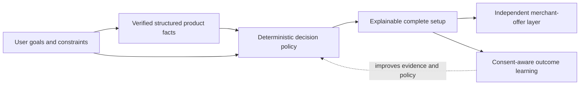
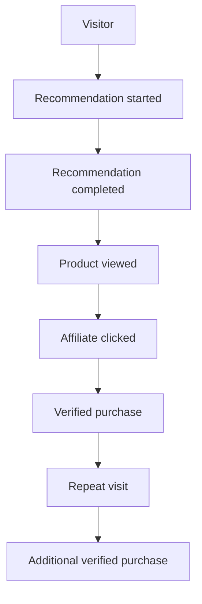

# UNSOLERO Business Model

Status: business architecture for the current product and its next monetization stages  
Product principle: **UNSOLERO is a trusted equipment decision engine, not a generic chatbot or a pay-to-rank marketplace.**

## Executive summary

UNSOLERO helps a high-intent consumer turn a goal, room, budget, experience level, preferences, and existing equipment into a complete and explainable home-gym purchasing plan. Its commercial opportunity comes from being useful immediately before a complex purchase while remaining credible enough to influence that purchase.

The initial model is affiliate commerce. UNSOLERO earns a commission when a user chooses a merchant after the objective recommendation has already been produced. Commission, sponsorship, and ownership must never change product eligibility, score, rank, rejection, alternatives, or recommendation reasons. That separation is both the central trust promise and a long-term competitive advantage.

The strongest defensible asset is not an audience alone. It is the combination of:

- normalized equipment facts and merchant offers;
- deterministic, constraint-aware recommendation policy;
- explainable compatibility, redundancy, and sequencing decisions;
- observed, consent-aware decision and commerce outcomes; and
- high-quality editorial distribution connected to the decision engine.

UNSOLERO should progress from affiliate revenue to direct merchant relationships, clearly separated sponsorship, optional premium decision tools, carefully validated own products, and aggregated B2B product intelligence. Each phase is evidence-gated. Later monetization should not be treated as inevitable.

## Current business capability

The application already supports much of the discovery-to-click journey. It does not yet observe verified purchases or revenue.

| Capability                                                            | Current state                                                                                                  | Business implication                                                                                             |
| --------------------------------------------------------------------- | -------------------------------------------------------------------------------------------------------------- | ---------------------------------------------------------------------------------------------------------------- |
| Structured catalog and offers                                         | Implemented with fictional demo data                                                                           | The product and merchant model is ready; production value depends on accurate, fresh, real catalog coverage.     |
| Deterministic recommendations                                         | Implemented with explainable scores, alternatives, and rejections                                              | This is the core consumer value and must remain commerce-independent.                                            |
| Recommendation onboarding                                             | Implemented for guests and authenticated users                                                                 | Starts and completions can be measured by attempt.                                                               |
| Product detail, comparison, wishlist, saved setups                    | Implemented                                                                                                    | Supports research, consideration, and return use cases.                                                          |
| Affiliate redirects and click attribution                             | Implemented                                                                                                    | Clicks can be associated with product, offer, surface, session, and optional user without exposing destinations. |
| First-party analytics                                                 | Implemented for page, onboarding, recommendation, product, save, comparison, setup, and affiliate-click events | Top- and middle-funnel behavior can be reported from observed data.                                              |
| Editorial acquisition foundation                                      | Implemented for curated articles, guides, buying guides, comparisons, category pages, sitemap, and metadata    | Organic acquisition is structurally supported, but only high-quality reviewed content should be published.       |
| Purchase/conversion ingestion                                         | Data target exists; authenticated provider import/webhook is not implemented                                   | Purchase, conversion, EPC, and revenue metrics must remain “No data” until verified.                             |
| Acquisition-cost ingestion                                            | Data target exists; import is not implemented                                                                  | CAC cannot yet be reported reliably.                                                                             |
| Marketing email consent and lifecycle messaging                       | Not implemented                                                                                                | Account email must not be treated as marketing opt-in or email capture.                                          |
| Subscription billing, sponsored inventory, own products, B2B delivery | Not implemented                                                                                                | These are hypotheses and roadmap stages, not current revenue capabilities.                                       |

The demo catalog contains explicitly fictional products and invalid merchant destinations. No commercial conclusions should be drawn from demo behavior.

## 1. Target customer

### Primary consumer

The initial target is a **high-intent first- or second-time home-gym builder** who expects to buy equipment soon but lacks confidence in the complete setup. The best early users have meaningful constraints and therefore receive more value than they would from a generic “best equipment” list.

Typical situations include:

- a beginner building a safe, versatile setup in an apartment or small room;
- a budget-conscious buyer deciding what to purchase first and what can wait;
- an intermediate lifter expanding a garage gym without duplicating capabilities;
- a comparison shopper evaluating several expensive products or merchants; and
- an owner upgrading an existing setup while preserving compatibility.

These are behavioral segments, not demographic assumptions. Initial segmentation should use intent, goal, budget, space, experience, owned equipment, and purchase horizon.

### Secondary consumer

Experienced home-gym owners can use UNSOLERO for upgrades, replacements, compatibility checks, price and offer comparison, and planning multiple configurations. They may have higher order value but usually require deeper product coverage, evidence, and specification precision.

### Future business customers

Potential B2B customers include retailers, equipment brands, editorial publishers, gym designers, and manufacturers that need normalized catalog facts, suitability taxonomy, market/offer observations, or a trustworthy recommendation capability. They are not the initial product customer and should not distort the consumer experience.

### Who is not the initial target

- People seeking general workout coaching rather than equipment decisions.
- Users with no plausible equipment purchase or planning intent.
- Commercial-gym procurement teams requiring facility design, tendering, or safety certification.
- Buyers expecting medical, rehabilitation, or professional training advice.

## 2. Customer pain

Home-gym purchases are a portfolio decision disguised as a collection of product decisions. Existing shopping experiences commonly optimize a single item, a merchant's inventory, or editorial clicks instead of the user's whole setup.

The customer must resolve several linked uncertainties:

1. **Need:** Which capabilities are necessary for the intended training goal?
2. **Constraint fit:** Will the equipment fit the room, budget, noise tolerance, storage needs, and experience level?
3. **Portfolio fit:** Does a product duplicate something already owned or block a later upgrade?
4. **Product quality:** Which specifications matter, which trade-offs are acceptable, and which products are poor value?
5. **Purchase sequence:** What should be bought now, deferred, upgraded, or deliberately skipped?
6. **Merchant choice:** Which currently available offer provides the best consumer outcome?
7. **Trust:** Is advice objective, or is it shaped by affiliate payout, sponsorship, or an undisclosed commercial relationship?

The cost of a bad decision is not only money. It includes wasted floor space, return friction, unsafe or incompatible equipment, unused products, and loss of confidence in the entire plan.

## 3. Value proposition

### Consumer promise

> Build the right set of products for your goals, budget, and what you already own—with exact products, explicit trade-offs, and no commission-driven ranking.

UNSOLERO should deliver:

- a complete setup rather than an isolated product list;
- a total cost and transparent budget fit;
- product-level reasons grounded in structured facts;
- cheaper and premium alternatives;
- compatibility and redundancy decisions;
- deliberately rejected products with reasons;
- a recommended purchase sequence and later upgrades; and
- comparable merchant options after the objective decision is complete.

### Why the proposition can be differentiated

Search results, merchant filters, creator lists, and conversational AI can each help with discovery, but none inherently solves constrained portfolio construction with reproducible reasoning. UNSOLERO's distinction is the trusted decision system:



AI may later improve natural-language understanding and explanation, but it cannot invent product facts or overrule deterministic eligibility and ranking.

## 4. Acquisition channels

Acquisition should begin with channels where users already express an equipment decision. Reach without intent is less valuable than qualified traffic that completes a recommendation.

| Channel                        | User intent                                           | Best destination                                       | Primary action                    | Operating rule                                                                                                            |
| ------------------------------ | ----------------------------------------------------- | ------------------------------------------------------ | --------------------------------- | ------------------------------------------------------------------------------------------------------------------------- |
| Search/SEO                     | Specific category, constraint, or comparison question | Reviewed guide, comparison, or category page           | View a product or start a setup   | Publish few excellent pages; do not mass-produce thin AI content.                                                         |
| YouTube                        | Demonstration and deeper research                     | Evidence-backed video plus relevant guide/setup entry  | Continue the decision on UNSOLERO | Show measurements, trade-offs, and methodology; disclose relationships verbally and in description.                       |
| TikTok/Instagram               | Problem discovery and short demonstrations            | Mobile landing page for the exact problem              | Start a short setup flow          | Use honest hooks, not artificial urgency or unsupported transformations.                                                  |
| Creator/editorial partnerships | Borrowed trust and niche expertise                    | Co-authored guide or preconfigured but editable intake | Complete a recommendation         | Preserve editorial independence and disclose payment/affiliate terms.                                                     |
| Organic referrals and sharing  | A useful setup or comparison is shared                | Read-only shared setup/comparison                      | Edit or build a personal setup    | Never expose the original user's private intake.                                                                          |
| Lifecycle email                | Return, price/availability change, planned upgrade    | Saved setup or product                                 | Revisit and act                   | Require explicit marketing consent, useful frequency controls, and easy unsubscribe. Not currently implemented.           |
| Paid search                    | High-value, measurable purchase intent                | Query-matched category or recommendation flow          | Complete recommendation and click | Scale only after verified conversion and contribution economics exist.                                                    |
| Merchant/brand distribution    | A partner sends shoppers needing guidance             | Clearly co-branded or embedded decision flow           | Complete objective recommendation | Partner payment cannot constrain the eligible catalog or ranking unless the surface is explicitly a single-merchant tool. |

Channel performance should be compared on recommendation completion, verified downstream value, repeat use, and trust signals—not traffic volume alone. Paid retargeting should require valid consent and should not use sensitive profile details.

### Internal linking strategy

Editorial pages should lead naturally to structured category facts, comparisons, and a pre-contextualized recommendation start. Product pages should link back to relevant guides and alternatives. Recommendation results should link to evidence-rich product details. This creates an acquisition loop without making content a collection of affiliate doorways.

## 5. Affiliate monetization

Affiliate commerce is the best initial model because payment can occur downstream of a useful decision and does not require UNSOLERO to operate checkout, inventory, fulfillment, returns, or warranty service.

### Operating model

1. The recommendation engine finalizes product eligibility, score, ranking, reasons, and alternatives without commerce data.
2. The commerce layer finds active, available offers for selected products.
3. Offer presentation prioritizes user benefit such as current landed price, availability, offer freshness, merchant reliability, and known return/warranty terms.
4. A user chooses **View at Merchant** through UNSOLERO's server redirect.
5. UNSOLERO records an attributed click and redirects to the stored HTTPS destination.
6. A future authenticated provider webhook or import records a verified pending, confirmed, or reversed conversion.

Commission metadata may be stored for reconciliation and business reporting, but it is not an input to recommendation ranking or the default consumer offer. Where offers are materially equivalent, the tie-breaker must be documented and user-benefiting rather than silently payout-maximizing.

### Economics

The model should be decomposed rather than forecast from unverified assumptions:

```text
Confirmed affiliate revenue
  = qualified visits
  × recommendation or product engagement rate
  × affiliate click-through rate
  × verified affiliate conversion rate
  × average confirmed net commission

Contribution after acquisition
  = confirmed net revenue
  − paid acquisition cost
  − variable provider, support, and content costs
```

Returns, cancellations, reversals, attribution windows, currency, and network fees must be reflected before revenue is considered final.

### Trust and disclosure requirements

- Place a plain-language affiliate disclosure near merchant actions and in a persistent policy page.
- Use **View at Merchant**, not **Buy**, while checkout is controlled by another company.
- Never cloak the existence of the commercial relationship, even though the raw tracking destination remains server-side for security.
- Show multiple valid merchants where available and make material price/availability differences understandable.
- Display offer freshness and limitations when production data supports them.
- Never present a click as a purchase or infer conversion from navigation alone.

## 6. Direct merchant partnerships

Direct relationships can improve both user value and unit economics when they provide more accurate offers, inventory, delivery costs, return terms, exclusive user discounts, or better postback data.

Possible commercial structures include direct CPA agreements, fixed placement on clearly commercial surfaces, data-feed/service fees, or hybrid agreements. Contracts must explicitly state that payment buys commerce access or labeled inventory—not objective recommendation position.

The first merchant program should offer:

- documented catalog and offer feed requirements;
- price, availability, region, delivery, return, and warranty freshness standards;
- authenticated conversion postbacks with reversal support;
- link and destination quality monitoring;
- aggregated, privacy-safe performance reporting; and
- no contractual right to suppress valid competitors or alter product scoring.

A direct merchant should be evaluated on consumer price competitiveness, availability accuracy, click-to-purchase performance, cancellation/return quality where known, support issues, and data reliability. Commission rate is a business metric, not a recommendation-quality metric.

## 7. Sponsorship opportunities

Sponsorship can monetize the audience only if it is visibly and technically separated from objective recommendations.

Acceptable opportunities include:

- a clearly labeled sponsor block in a guide;
- sponsorship of a video series or category education hub;
- a labeled placement after the complete objective recommendation;
- a labeled newsletter placement for opted-in subscribers; or
- a sponsored product education module that meets factual review standards.

Unacceptable opportunities include:

- selling a higher recommendation score or rank;
- inserting a sponsored product into the objective setup, alternatives, or rejected list;
- changing reasons, badges, or comparisons to favor a payer;
- “best product” awards sold to brands;
- native styling that makes a paid placement indistinguishable from an objective result; or
- suppressing a better competitor as a condition of payment.

Sponsored inventory should have explicit machine-readable metadata, an unavoidable visible **Sponsored** label, a relevance and quality floor, frequency caps, creative review, and separate reporting. Admin review should show objective and sponsored surfaces side by side. Sponsor revenue should be reported separately from affiliate performance.

## 8. Premium subscription opportunities

A subscription is plausible only if users return for ongoing decisions. A one-time equipment recommendation by itself is unlikely to justify indefinite payment for many consumers.

Potential premium value should center on continuing utility:

- a multi-stage upgrade plan with scenario and budget versions;
- monitoring of saved products and setup price/availability once reliable feeds exist;
- household or coach collaboration and controlled sharing;
- multiple room/setup workspaces and comparison history;
- richer exports, decision records, and equipment lifecycle planning; and
- higher-touch expert review or support.

Premium must not remove trust from the free experience. Basic objective ranking, material trade-offs, affiliate disclosure, and access to competing merchant offers should not be paywalled. AI-written polish alone is not a durable premium proposition, and AI must remain subordinate to canonical facts and deterministic decisions.

Subscription development should wait for evidence of repeat behavior, a recurring unresolved job, and real willingness to pay. Registration or a fake-door click is not proof of willingness to pay.

## 9. Own-product opportunity

First-party products could capture more margin and solve gaps revealed by repeated, aggregated recommendation outcomes. This phase also creates the greatest conflict of interest and operational risk.

Candidate selection should require evidence that:

- many users share a specific unmet need;
- existing products repeatedly fail a measurable constraint;
- the problem can be solved with a meaningfully better specification or bundle;
- compliant production, product liability, quality control, fulfillment, returns, and support are economically viable; and
- the product can earn its place under the same published recommendation policy as every other product.

UNSOLERO-owned products must be visibly identified, scored with the same facts and weights, and allowed to lose. Ownership cannot change eligibility, ranking, alternatives, or explanations. Product performance and returns should be reviewed by people who do not own the recommendation revenue target.

The safest learning sequence is an evidence-backed concept page, interviews, prototype evaluation, transparent waitlist, and only then a clearly refundable preorder after specifications, costs, compliance, and delivery risks are known. Start with a narrow, lower-complexity unmet need rather than building inventory merely because a category attracts clicks.

## 10. B2B product intelligence opportunity

Once the catalog and outcome data are sufficiently complete and reliable, UNSOLERO can offer business customers:

- normalized equipment specifications and taxonomy;
- price, availability, and merchant coverage feeds;
- suitability and compatibility data with methodology and evidence;
- anonymized aggregate demand and constraint trends;
- catalog gap and portfolio benchmarking;
- recommendation-as-a-service that preserves UNSOLERO's integrity rules; and
- editorial/product research tooling.

Potential customers include retailers, manufacturers, brands, publishers, and specialized gym planners. Early delivery can be a paid report or managed data export before a self-service API is justified.

B2B products must not sell personal profiles or raw free text. Aggregation thresholds, purpose limitation, retention rules, deletion handling, contractual use restrictions, and a published methodology are required. A retailer-specific experience that searches only that retailer's inventory must say so clearly; it must not masquerade as the independent whole-market recommendation.

## Funnel and measurement model

### Canonical funnel



`recommendation_generated` is an important integrity checkpoint between completion and result consumption: a completed intake should produce a valid deterministic result. It should be monitored separately from the user-facing funnel stage.

### Stage definitions and current observability

| Stage                    | Operational definition                                                                                                                | Current observation                                                                               |
| ------------------------ | ------------------------------------------------------------------------------------------------------------------------------------- | ------------------------------------------------------------------------------------------------- |
| Visitor                  | A distinct qualified browser session with at least one accepted `page_view`; known bots and internal/test traffic should be excluded. | Available by first-party session, with bounded source/medium/campaign when present.               |
| Recommendation started   | A unique onboarding attempt with `onboarding_started`.                                                                                | Available through `onboarding_id`.                                                                |
| Recommendation completed | The same onboarding attempt records `onboarding_completed`.                                                                           | Available and paired with starts.                                                                 |
| Recommendation generated | The backend successfully creates a deterministic recommendation.                                                                      | Available through `recommendation_generated` and persisted recommendation sessions.               |
| Product viewed           | The session opens a product detail for a specific product.                                                                            | Available through `product_viewed`.                                                               |
| Affiliate clicked        | The backend validates an offer and records the redirect.                                                                              | Available through the server-authored click event and commerce click record.                      |
| Purchase                 | A provider reports a deduplicated pending/confirmed/reversed conversion attributed to a click.                                        | Not available until authenticated provider ingestion is implemented. Never infer it from a click. |
| Repeat visit             | The same consent-valid user or pseudonymous subject returns in a later qualified session within a declared cohort window.             | Raw identity/session activity exists; a governed repeat-user report is not implemented.           |
| Additional purchase      | The same customer has a second confirmed conversion after the first.                                                                  | Not available until verified conversion ingestion and privacy-safe identity rules exist.          |

Every analysis must declare date range, timezone, identity rule, attribution window, source inclusion, and currency treatment. Anonymous-to-user identity merging must be explicit and consent-aware.

## Metrics to monitor

No rate should be displayed when its denominator is zero or unavailable. It should show **No data**, not `0%`. Revenue metrics use confirmed net commissions or recognized direct revenue, not estimated order value.

| Metric                         | Definition                                                                                                                                        | Required data / current readiness                                                                                                                                           |
| ------------------------------ | ------------------------------------------------------------------------------------------------------------------------------------------------- | --------------------------------------------------------------------------------------------------------------------------------------------------------------------------- |
| Traffic                        | Distinct qualified sessions and page views, segmented by landing page and acquisition source.                                                     | Page views and sessions exist. Bot/internal-traffic controls must be finalized before business reporting.                                                                   |
| Recommendation Completion Rate | Unique onboarding attempts completed ÷ unique onboarding attempts started.                                                                        | Implemented from paired `onboarding_id` values. Also report sample size and step-level abandonment when instrumented.                                                       |
| Product CTR                    | Unique product-detail opens from a defined product impression surface ÷ unique eligible product impressions on that surface.                      | Product views exist; impression/result-view events do not. Do not approximate this using unrelated page views. Define separate recommendation, catalog, and editorial CTRs. |
| Affiliate CTR                  | Unique validated merchant clicks ÷ unique eligible merchant-CTA impressions.                                                                      | Clicks exist. The current admin proxy uses matched product/session views for product-detail clicks; add CTA impressions for the canonical metric. Segment by surface.       |
| Affiliate Conversion Rate      | Unique confirmed conversions ÷ unique attributable affiliate clicks within the provider's attribution window.                                     | Conversion table exists but provider ingestion does not. Deduplicate external conversion IDs and report pending/reversed states separately.                                 |
| Earnings Per Click             | Confirmed net commission ÷ unique attributable affiliate clicks.                                                                                  | Requires verified commission, currency normalization, and reversal handling.                                                                                                |
| Revenue Per Visitor            | Confirmed net revenue attributed to a cohort ÷ qualified visitor sessions in that cohort.                                                         | Requires verified revenue and a declared attribution model. Also report contribution per visitor after variable cost.                                                       |
| Revenue Per Recommendation     | Confirmed net revenue attributed to a recommendation ÷ completed recommendations.                                                                 | Recommendation IDs can be attached to clicks; verified conversion ingestion is still required.                                                                              |
| Repeat User Rate               | Eligible users/subjects with another qualified session in the declared window ÷ eligible users/subjects in the starting cohort.                   | Requires a governed 30-, 60-, or 90-day cohort report. Keep authenticated and anonymous rates separate.                                                                     |
| Email Capture Rate             | Visitors providing explicit, recorded marketing consent ÷ eligible unique visitors shown the opt-in.                                              | Not implemented. Registration email is an account credential, not marketing consent.                                                                                        |
| Customer Acquisition Cost      | Verified acquisition spend ÷ newly acquired customers under a declared definition and window.                                                     | Acquisition-cost table exists but import does not. Report cost per activated user and cost per purchasing customer separately.                                              |
| Lifetime Value                 | Cohort-level realized gross contribution across the declared horizon, including confirmed revenue, reversals/refunds, and variable service costs. | Requires verified revenue, repeat identity, cost allocation, and time. Do not use a speculative single-number LTV early.                                                    |

### Required metric cuts

At minimum, analyze the funnel by acquisition source/medium/campaign, landing-page type, device class, authentication state, recommendation goal, experience, space class, budget band, product category, merchant, and commerce surface. Use minimum cohort sizes and privacy-safe aggregation. Do not expose raw user profiles in business dashboards.

### Diagnostic metrics

The headline metrics need supporting diagnostics:

- onboarding abandonment by step and validation error;
- successful recommendations per completed intake;
- “no suitable product” and over-budget rates;
- recommendation-to-product-view rate;
- save, comparison, and setup-save rates;
- offer coverage, availability, and freshness;
- broken or rejected redirect rate;
- purchase reversal/cancellation rate once observable;
- return latency and saved-setup reopen rate; and
- trust complaints, disclosure comprehension, and recommendation-quality feedback.

Optimizing affiliate CTR alone is unsafe: it can reward aggressive CTAs while reducing trust or decision quality. Funnel metrics must be reviewed alongside recommendation completion, repeat use, disclosure comprehension, and complaint/return signals.

## Monetization roadmap

Phases are evidence gates, not calendar commitments. Discovery for a later phase may begin earlier, but production rollout should wait for the stated prerequisites.

### Phase 1 — Affiliate commissions

**Offer:** objective recommendations and comparisons with tracked merchant options.  
**Build next:** production catalog/offer ingestion, destination monitoring, provider conversion imports/webhooks, reversal reconciliation, consent policy, and revenue reporting.  
**Validate:** qualified users complete recommendations, merchant CTAs are useful, confirmed conversions occur, and disclosure does not reduce comprehension or trust.  
**Gate to scale:** reliable catalog freshness and positive contribution after content/traffic costs. Do not buy meaningful traffic before conversion data is trustworthy.

### Phase 2 — Direct brand and merchant relationships

**Offer:** better data integration, direct attribution, user discounts, and aggregated performance reporting.  
**Build:** feed contracts, provider adapters, partner-quality scorecards, reconciliation, and operational SLAs.  
**Validate:** partners improve price/availability coverage or economics without reducing recommendation integrity.  
**Guardrail:** no rank guarantees, competitor suppression, or exclusive catalog presented as whole-market advice.

### Phase 3 — Clearly labeled sponsored placements

**Offer:** separate sponsorship inventory in editorial, video, newsletter, or post-result surfaces.  
**Build:** distinct sponsored-placement model, disclosure metadata, review/approval, frequency caps, and separate reporting.  
**Validate:** sponsors pay for relevant, visible inventory and users can reliably distinguish it from objective results.  
**Guardrail:** sponsorship never enters recommendation eligibility, scoring, reasons, alternatives, or rejected products.

### Phase 4 — Premium personalized features

**Offer:** recurring planning, monitoring, collaboration, and higher-touch support only where an ongoing job is demonstrated.  
**Build:** the smallest paid feature that can be delivered reliably, then billing, entitlement, cancellation, support, and refund operations.  
**Validate:** informed users pay, use the feature repeatedly, retain, and report continuing value.  
**Guardrail:** do not paywall objective truth, disclosure, or essential comparison merely to manufacture conversion.

### Phase 5 — Own products

**Offer:** a product that solves a repeatedly observed market gap better than available alternatives.  
**Build:** prototypes, compliance and safety evidence, supplier QA, product liability coverage, fulfillment, returns, support, and conflict-of-interest governance.  
**Validate:** paid demand, acceptable cancellation/return behavior, defensible contribution margin, and objective recommendation performance.  
**Guardrail:** UNSOLERO products use the same policy and can rank below or be rejected in favor of competitors.

### Phase 6 — B2B product intelligence

**Offer:** normalized data, aggregate insights, benchmarking, and integrity-preserving recommendation services.  
**Build:** data quality SLAs, licensing, versioned exports/API, access control, auditability, privacy thresholds, and customer support.  
**Validate:** paid design partners renew because the data changes a real business decision.  
**Guardrail:** sell aggregated intelligence and licensed product facts, never personal profiles or undisclosed influence over consumer rankings.

## Willingness-to-pay experiments

All experiments must state that a feature is planned when it is not yet available. A click is interest; only an informed payment for delivered value is strong willingness-to-pay evidence. Price and success thresholds should be preregistered before results are viewed.

| Experiment                         | Hypothesis and method                                                                                                                                                                                                                                    | Strong evidence                                                                                                                            | Guardrail                                                                                                        |
| ---------------------------------- | -------------------------------------------------------------------------------------------------------------------------------------------------------------------------------------------------------------------------------------------------------- | ------------------------------------------------------------------------------------------------------------------------------------------ | ---------------------------------------------------------------------------------------------------------------- |
| Upgrade Planner price test         | After a setup is saved, show a transparent early-access page describing multi-stage budgets and price monitoring. Randomize clearly stated price hypotheses such as €6, €10, and €15/month; collect explicit opt-in, not payment, until delivery exists. | Qualified opt-in by price point, followed by paid conversion when the smallest real version launches.                                      | Label it “planned”; do not imply activation or charge a card for unavailable software.                           |
| Paid expert review pilot           | Offer a genuinely delivered 30-minute setup review to a small, capacity-limited cohort at two disclosed one-time price points, for example €39 and €79.                                                                                                  | Completed payments, low refund rate, manageable fulfillment time, and customers reporting that the review changed or confirmed a decision. | Human review must follow the same fact and commercial-independence rules; capacity limits must be real.          |
| Price and availability alert pilot | Ask saved-product users whether they want a real weekly alert, with explicit marketing consent. Deliver it manually or with a small reliable feed before testing a paid bundle.                                                                          | Continued usage and payment for an operating alert, not waitlist signups alone.                                                            | Never invent price history, “drops,” scarcity, or availability. Provide unsubscribe and frequency control.       |
| Multi-scenario workspace pilot     | Let frequent users test multiple rooms, budgets, and setup versions; after active use, offer a paid monthly or annual continuation.                                                                                                                      | Paid activation plus scenario reuse and retention over at least two decision cycles.                                                       | Keep one complete, objective setup available for free.                                                           |
| Direct merchant data pilot         | Ask one merchant to fund a time-boxed integration that improves verified offer freshness and conversion reporting, without placement rights.                                                                                                             | A paid pilot, measurable data-quality improvement, and renewal interest.                                                                   | Contractually exclude recommendation influence and report partner inventory limits.                              |
| B2B design-partner report          | Interview a narrow buyer group, then sell a manually delivered, privacy-safe category/assortment report before building an API. Test a concrete monthly or project price based on scope.                                                                 | Payment, use in a documented decision, repeat request, and acceptable delivery margin.                                                     | Use minimum cohorts; exclude personal profiles and unlicensed data.                                              |
| Own-product gap validation         | For a gap already visible in aggregated recommendation/rejection data, test a factual concept with interviews and a waitlist. Accept refundable preorders only after a reviewed prototype, specifications, costs, risks, and delivery window exist.      | Informed refundable orders that persist through final specification and delivery confirmation.                                             | Do not boost the concept in recommendations, fabricate renders/claims, or treat a waitlist as production demand. |

For each consumer experiment, record exposure, eligibility, variant, opt-in or payment, cancellation/refund, actual use, support burden, and trust feedback. Stop an experiment if it creates confusion about availability, payment, sponsorship, or recommendation independence.

## Trust and governance charter

The following rules apply across every phase:

1. Affiliate commission, sponsorship payment, merchant relationship, and product ownership never change objective product eligibility, score, rank, alternatives, rejection, compatibility, or reasons.
2. Commercial relationships are disclosed in plain language at the point of relevance; disclosures are never hidden only in terms and conditions.
3. Sponsored inventory is stored, rendered, and measured separately from objective recommendations.
4. Product facts require provenance and freshness. UNSOLERO does not invent specifications, prices, reviews, availability, discounts, or scarcity.
5. Merchant checkout is described accurately. UNSOLERO uses **View at Merchant** until it controls checkout.
6. Own products compete under the same recommendation policy and may lose.
7. Analytics reports observed behavior. Missing conversions, revenue, or cost remain **No data**.
8. Personal data is minimized, consent-aware, purpose-limited, and never sold as product intelligence.
9. Recommendation-policy changes are versioned and evaluated against a fixed corpus; commercial teams cannot edit weights ad hoc.
10. Business performance is reviewed with user-outcome and trust measures, not revenue or click-through rate in isolation.

## Principal risks and mitigations

| Risk                                         | Why it matters                                                                            | Mitigation                                                                                                                           |
| -------------------------------------------- | ----------------------------------------------------------------------------------------- | ------------------------------------------------------------------------------------------------------------------------------------ |
| Insufficient catalog coverage or stale facts | A decision engine is only as reliable as its inputs.                                      | Prioritize fewer categories with excellent evidence, freshness SLAs, and visible limitations before expanding.                       |
| Low purchase frequency                       | Home-gym builds can be episodic, limiting subscription and repeat rate.                   | Focus premium research on recurring upgrade/monitoring jobs; use cohort evidence before building subscription infrastructure.        |
| Affiliate attribution loss                   | Browser privacy, cross-device journeys, and merchant rules can undercount conversions.    | Use provider-supported server postbacks/imports, transparent attribution windows, deduplication, and conservative reporting.         |
| Commercial pressure on recommendations       | Short-term payout optimization can destroy the core brand promise.                        | Enforce code-level boundaries, contracts, audits, published methodology, and separate team permissions/metrics.                      |
| SEO dependence                               | Search volatility can make acquisition fragile.                                           | Build direct return value, useful sharing, opted-in lifecycle channels, video/editorial diversity, and brand demand.                 |
| Content cost and credibility                 | High-quality reviews and guides are expensive; thin content harms trust and search value. | Publish selectively, reuse structured evidence, maintain editorial review, and measure assisted decisions rather than article count. |
| Demo-to-production gap                       | Fictional demo products cannot validate commercial behavior.                              | Establish real data licensing/permission, merchant destinations, evidence, and production QA before public monetization.             |
| Regulatory and disclosure variation          | Affiliate, advertising, privacy, email, and consumer rules vary by market.                | Obtain jurisdiction-specific legal review, retain consent/disclosure records, and design for regional configuration.                 |
| Own-product conflict and operational load    | Inventory, safety, returns, and self-preferencing create material risk.                   | Enter only after evidence gates, create independent recommendation governance, and budget full operational liability.                |
| B2B privacy or methodology misuse            | Aggregate insights can become re-identifying or be sold as unsupported certainty.         | Apply minimum cohorts, contractual restrictions, audit logs, methodology documentation, and no raw personal data.                    |

## Near-term business priorities

1. Replace demo-only commercial data with a narrow, verified production catalog and reliable offer freshness.
2. Implement authenticated conversion ingestion and reconciliation before reporting or optimizing revenue.
3. Add precise impression events for product and merchant surfaces so Product CTR and Affiliate CTR have valid denominators.
4. Define consent, bot/internal-traffic exclusion, attribution windows, identity rules, currency normalization, and data retention in a measurement specification.
5. Publish a visible affiliate/sponsorship policy and preserve the existing technical separation from recommendation scoring.
6. Acquire a small cohort through high-intent guides and measure completion, recommendation usefulness, product engagement, and verified purchase outcomes.
7. Interview returning users about upgrade planning and monitoring, then run one transparent paid-service or real-feature experiment.

The near-term objective is not maximum monetization. It is proving that UNSOLERO can repeatedly create a trusted decision, connect that decision to a verified commercial outcome, and earn revenue without compromising the reason the user trusted it.
