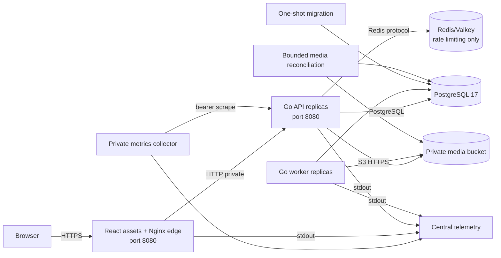
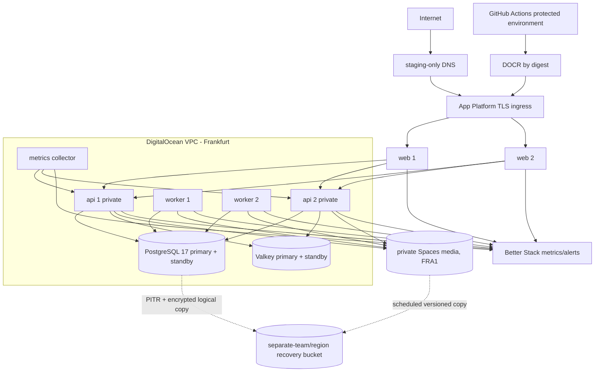

# UNSOLERO Phase 13 infrastructure plan

Status: **repository hardening implemented; hosted execution BLOCKED**  
Prepared: 2026-08-18  
Baseline: Phase 12 `PARTIAL`, strict readiness score 7.8/10

This is an execution plan, not hosted evidence. No cloud resource, provider,
credential, DNS record, image, backup, alert, or customer-facing environment was
created while preparing it. All data used in Phase 13 must be fictional and
staging-only.

## Current execution update

The repository contains no `vercel.json`, `.vercel` project link, Vercel
project/team identifier, deployment token, configured domain value, or
production/preview deployment evidence. The operator's statement that Vercel
and a domain exist is not enough to identify or mutate them safely. No Vercel
configuration, DNS, or traffic was changed.

Vercel is suitable for the compiled React assets, but the current production
web container also performs same-origin `/api` proxying and asks the Go route
resolver for canonical metadata and genuine HTTP 404 decisions. A generic Vite
SPA fallback on Vercel would turn unknown routes into soft 404s, while a
frontend-only deployment without a same-origin proxy would change the secure
cookie/CORS architecture. Therefore Vercel is **not** the production edge until
an identified project and external backend origin are available and that proxy
plus route-resolution behavior is implemented and tested. It may be used for
isolated frontend previews after deployment protection and non-production
environment variables are verified.

The Go API, commerce worker, migrations, media jobs, PostgreSQL, Redis/Valkey,
object storage, backup scheduling, private metric collection, and alert
delivery must remain outside Vercel. The smallest correct deployable topology
continues to be a container platform for web/API/workers/jobs plus managed
PostgreSQL, managed TLS Redis/Valkey, and private S3-compatible storage. The
DigitalOcean topology below remains a costed proposal, not an authorized or
provisioned decision.

Relevant platform behavior: Vercel documents external rewrites for proxying to
another origin, and its Vite guidance requires explicit rewrites for SPA deep
links. Those capabilities do not by themselves reproduce UNSOLERO's dynamic
404/canonical resolver or supply a long-running worker runtime.

- [Vercel rewrites](https://vercel.com/docs/routing/rewrites)
- [Vercel Vite deployment behavior](https://vercel.com/docs/frameworks/frontend/vite)
- [Vercel deployment protection scope](https://vercel.com/docs/deployment-protection)

## Decision

Propose **DigitalOcean App Platform in the Frankfurt region**, with managed
PostgreSQL 17, managed Valkey, private Spaces object storage, DigitalOcean
Container Registry, an App Platform VPC attachment, and Better Stack for
central logs, Prometheus-compatible metrics, uptime, heartbeats, and delivered
alerts. Keep merchant, conversion, AI, live email, financial, and real customer
providers disabled. Use a Mailtrap-style non-delivering email sandbox only if
it is separately approved.

This provider choice requires explicit owner authorization before any resource
is created. Do not introduce Kubernetes for the first hosted staging deployment. The
current modular monolith has three long-running process types and bounded
one-shot jobs; App Platform directly supports that topology. DOKS would add
cluster, ingress, certificate, workload identity, upgrade, network policy, and
observability ownership before the application needs them.

## 1. Repository infrastructure audit

Status meanings: `PASS` is repository/local evidence only, `PARTIAL` needs
hosted work, `BLOCKED` needs external access or evidence, `MISSING` is not
implemented, and `NOT APPLICABLE` is intentionally excluded.

| Area | Status | Repository evidence | Hosted suitability and remaining work |
|---|---|---|---|
| Docker | PASS | `backend/Dockerfile`, `frontend/Dockerfile`; digest-pinned bases, multi-stage targets, non-root/read-only runtimes | Build every release target in hosted CI, scan, generate SBOMs, sign, push, and record registry digests. Current images have no trusted hosted provenance. |
| Docker Compose | PASS locally / PARTIAL | `compose.yaml`, `compose.staging.yaml`; two APIs, two workers, PostgreSQL 17, authenticated Redis, MinIO, TLS edge | Correct local validation topology, not a cloud deployment specification. Do not deploy Compose to a single VM and call it production-equivalent. |
| Kubernetes/Helm | NOT APPLICABLE | No manifests or charts | Not required for the selected App Platform target. Reconsider only after a demonstrated platform limitation. |
| Terraform/OpenTofu | MISSING | No IaC files or remote state | Phase 13 may add narrowly scoped OpenTofu for project/VPC/database/Valkey/registry resources. App secrets must not enter state. App topology should use a reviewed App Spec. |
| Ansible | NOT APPLICABLE | No playbooks | No mutable servers are selected. |
| GitHub Actions | PARTIAL | `.github/workflows/ci.yml`, `.github/workflows/security.yml`; immutable action SHAs | Definitions exist, but no trusted hosted run, artifact, branch protection, environment approval, or repository access was observed in Phase 12. |
| CI/CD | PARTIAL | Local checks, security workflow, build targets, runbooks, and a manual release-candidate workflow that publishes commit-addressed images and records registry digests | No protected hosted run, verified signature/provenance, candidate deployment, approval, hosted smoke, rollback, or promotion evidence exists. |
| PostgreSQL | PARTIAL | PostgreSQL 17 migrations, bounded `pgx` pools/timeouts, exact migration-manifest readiness; owner-applied runtime/backup grants are codified | No managed TLS cluster, standby, issued separated identities, hosted capacity, PITR exercise, or measured RPO/RTO. |
| Redis-compatible limiter | PARTIAL | Atomic Redis adapter and failure tests; local authenticated Redis | Provision private TLS managed Valkey with a standby. Configure `rediss://`, persistence, eviction, trusted sources, alerts, and an authorized failover exercise. |
| S3-compatible media | PARTIAL | Private S3 adapter, content-addressed keys, integrity checks, inventory reconciliation | Provision a private versioned bucket and limited key. Spaces has no built-in bucket backup; create a separate-region/account recovery copy and prove restoration. |
| Email | PARTIAL | Development sink, disabled adapter, transactional SMTP adapter | A non-delivering sandbox can test SMTP. Production delivery, sender-domain reputation, bounce/complaint processing, and legal approval remain BLOCKED. |
| Secrets/configuration | PARTIAL | Strong environment validation and fail-closed provider selection | No external secret store or rotation evidence. Use App Platform encrypted runtime variables for staging, GitHub protected environment secrets for deployment credentials, and bindable managed-service values. Access to the app console is secret-equivalent. |
| TLS/DNS | PARTIAL | Local self-signed TLS, secure cookies, production HTTPS validation, HSTS/CSP headers | App Platform must issue a real certificate for a staging-only hostname. DNS ownership and certificate issuance are BLOCKED. Do not enable HSTS on an unapproved parent domain. |
| Reverse proxy/edge routing | PASS locally / PARTIAL | Nginx bounded public-route resolver, genuine 404s, static security headers | Preserve web-as-edge topology and verify internal `api:8080` resolution, original path handling, forwarded-proxy trust, 404s, sitemap, robots, and SEO headers on App Platform. |
| Liveness/readiness | PASS locally / PARTIAL | `/api/v1/health/live`, `/api/v1/health/ready`, exact schema and critical dependency checks | Configure separate platform liveness/readiness probes and externally monitor readiness. Worker only has process liveness; durable progress must come from database metrics/heartbeats. |
| Metrics | PARTIAL | Authenticated JSON/OpenMetrics; bounded HTTP, pool, Redis, durable job, media, backup/restore metrics | Deploy a private scraper/remote-write collector, scrape every API replica, deduplicate durable gauges, retain history, and prove alert delivery. Metrics must not be routed through public ingress. |
| Logging | PARTIAL | Privacy-filtered structured JSON logs and safe database error classes | Forward all component logs to a central sink; set retention, redaction review, access, and alert rules. App Platform forwarding truncates messages above its provider limit, so preserve bounded log records. |
| Tracing | MISSING | No OpenTelemetry tracing | Not a Phase 13 launch prerequisite. Do not add tracing until hosted metrics/logs show an unresolved correlation need. Never attach user/product/free-text payloads. |
| Alerting | PARTIAL | Provider-neutral notifier plus bounded authenticated HTTPS webhook; production rejects disabled delivery | A real destination, central rule installation, delivery/acknowledgement evidence, certificate/deployment probes, and on-call action remain external. |
| Backups | PARTIAL | Atomic checksum/fingerprint local logical dump plus `age` archive encryption/decryption boundary | Managed PostgreSQL PITR, scheduled off-site upload/retention, key custody, and measured restore remain external. |
| Migrations | PASS locally / PARTIAL | Embedded immutable checksums, advisory lock, per-migration transactions, schema readiness | Run the exact candidate migration image once as a `PRE_DEPLOY` job using a migration role. Prove compatible expand/contract behavior and rollback decision. |
| Restore | PASS locally / BLOCKED hosted | Clean-target restore rejects corruption and non-empty targets | Restore managed PITR and off-site logical backup into isolated hosted targets, verify migration fingerprint and smoke tests, and measure time. |
| Disaster recovery | BLOCKED | Runbooks and local dependency drills only | No hosted PITR, managed failover, storage recovery, delivered paging, independent witness, or measured RPO/RTO exists. |
| Rollback | PARTIAL | Provider-neutral deployment runbook and immutable migration policy | App Platform supports recent deployment rollback, but no candidate has been promoted or rolled back. Database state is not rolled back with an app deployment. |
| Image signing/provenance | PARTIAL | The manual candidate workflow supports OIDC keyless Cosign signing with an immutable action SHA | No hosted signature, certificate identity, transparency record, verification policy or deployment admission evidence exists. |
| SBOM | PARTIAL | Anchore SPDX workflow definition | Generate per-image and source SBOMs in hosted CI, retain them with the release manifest, and prove artifact download. |
| Vulnerability/secret/SAST scanning | PARTIAL | npm audit, govulncheck, secret patterns, gitleaks, Semgrep and Trivy definitions | Hosted gitleaks/Semgrep/Trivy results remain unobserved. Do not convert workflow configuration into PASS. |
| Dependency review | PARTIAL | PR dependency-review job uses an immutable action SHA and rejects new HIGH/CRITICAL findings | Hosted execution and repository-plan availability are unobserved. |
| Container scanning | PARTIAL | Security workflow builds/scans web, API, worker, migration, and media job images and creates per-image SBOMs | Hosted results, signed provenance, suppression governance, and registry admission remain unobserved. |
| Media malware scanning | BLOCKED | Development format/signature validator; external adapter intentionally unlinked | Use only controlled fictional files in staging. Public uploads and production launch remain blocked until a reviewed scanner is linked and exercised. |

## 2. Actual application architecture

### Processes and dependencies

| Process | Protocol/port | Persistent writes | Critical dependencies | Failure behavior |
|---|---|---|---|---|
| `web` | public HTTPS at platform; container HTTP 8080 | none | API for routes/API, image itself for assets | platform removes an unhealthy replica; unknown public routes return genuine 404 |
| `api` | private HTTP 8080 behind web | PostgreSQL; media objects; Redis limiter state | PostgreSQL, Valkey when replicated, object storage | readiness closes on any critical dependency; protected rate-limited work fails closed |
| `worker` | no public port; process liveness | PostgreSQL durable import/conversion/job state; media cleanup | PostgreSQL, object storage; providers remain disabled | bounded cycle, durable leases, retry/recovery; repeated failure currently only logs because app notifier is disabled |
| `migrate` | one-shot | schema and migration ledger | PostgreSQL migration role | advisory lock and checksum mismatch fail deployment |
| `seed` | manual one-shot only | explicitly fictional demo rows | PostgreSQL | never runs automatically and never targets production |
| `media-init` | one-shot | bucket creation only if absent | object storage | hosted bucket should be provisioned first; use as a readiness assertion with limited credentials |
| `media-reconcile` | scheduled/manual one-shot | reconciliation audit and safe deletion queue | PostgreSQL, object storage | dry-run by default; apply requires explicit incident/change authorization |

PostgreSQL is the transactional source of truth and the durable job store.
Valkey is not a source of product, identity, recommendation, or financial truth;
it is nevertheless availability-critical because multi-replica abuse controls
fail closed when it is unavailable. Spaces contains product media and is also a
readiness-critical dependency. Better Stack and the container registry must not
be request-path dependencies.

### Current single points of failure

- Local Compose PostgreSQL, Redis, MinIO, TLS edge, and Docker host are each a
  single failure domain. Local two-replica counts do not change that.
- No hosted DNS, certificate, VPC, managed database, registry, telemetry, or
  alert destination exists.
- The selected App Platform design remains single-region. Two instances remove
  a process failure, not a regional/provider failure.
- App Platform encrypted values can be exposed by anyone who can change app
  code/config or use its console; membership must be treated as privileged.
- Spaces has versioning but no built-in backup; a second copy is mandatory.

## 3. Provider comparison

Prices are public list prices observed on 2026-08-18, exclude tax/support and
vary with region, transfer, retention, and usage. They are estimates, not
quotes.

| Provider | Fit | Advantages | Material disadvantages | Decision |
|---|---|---|---|---|
| DigitalOcean | Best current proposal for first staging | App Platform supports digest images, workers/jobs, HA with 2+ instances, TLS, VPC, log forwarding and rollback; managed PostgreSQL/Valkey and Spaces are available with predictable pricing | Encrypted app variables are not a full vault; custom metrics need a collector; Spaces needs a separate backup; managed-service fault injection is limited | **Proposed; owner authorization required** |
| Hetzner | Low-cost self-managed option | Inexpensive VMs, private networks, managed load balancer, S3-compatible object storage | No repository-evidenced managed application platform, PostgreSQL, or Valkey choice matching the requested operational model; UNSOLERO would own clustering, patching, backups, failover, secrets and telemetry | Reject for Phase 13; operational burden is the wrong trade |
| AWS | Strongest full-control option | ECS/Fargate, RDS, ElastiCache, S3/Object Lock, ECR, Secrets Manager, CloudWatch and mature IAM cover all controls | More services, IAM/network policy, NAT/egress and variable billing; slower first deployment for the current team and traffic | Re-evaluate for production or stricter compliance/region requirements |
| Azure | Complete managed option | Container Apps, PostgreSQL Flexible Server, managed Redis, Blob, ACR, Key Vault and Monitor | Similar control-plane complexity and variable billing to AWS without a repository/team-specific advantage | Reject for first staging |

Official source references:

- [App Platform pricing and instance sizes](https://docs.digitalocean.com/products/app-platform/details/pricing/)
- [digest-addressed App Platform images](https://docs.digitalocean.com/products/app-platform/how-to/deploy-from-container-images/)
- [App Platform VPC connectivity](https://docs.digitalocean.com/products/app-platform/how-to/enable-vpc/)
- [managed PostgreSQL backup/PITR behavior](https://docs.digitalocean.com/products/databases/postgresql/how-to/restore-from-backups/)
- [managed PostgreSQL standby failover](https://docs.digitalocean.com/products/databases/postgresql/how-to/add-standby-nodes/)
- [managed Valkey standby constraints](https://docs.digitalocean.com/products/databases/valkey/how-to/add-standby-nodes/)
- [Spaces pricing and limits](https://docs.digitalocean.com/products/spaces/details/pricing/) and [lack of built-in bucket backup](https://docs.digitalocean.com/products/spaces/details/limits/)
- [DigitalOcean Container Registry pricing](https://docs.digitalocean.com/products/container-registry/details/pricing/)
- [Hetzner current cloud pricing](https://docs.hetzner.com/general/infrastructure-and-availability/price-adjustment/) and [load balancer model](https://www.hetzner.com/cloud/load-balancer/)
- [AWS ECS/Fargate pricing model](https://aws.amazon.com/ecs/pricing/)
- [Azure Container Apps pricing model](https://azure.microsoft.com/en-us/pricing/details/container-apps/)

## 4. Target staging architecture

### Resources and initial sizing

| Resource | Initial staging shape | Reason |
|---|---|---|
| App Platform `web` | 2 × `apps-s-1vcpu-1gb` | HA-compatible shared plan; current Nginx route resolver remains the public edge |
| App Platform `api` | 2 × `apps-s-1vcpu-1gb` | exercises distributed rate limiting and replica-local telemetry |
| App Platform `worker` | 2 × `apps-s-1vcpu-1gb` | exercises PostgreSQL leases and worker loss/recovery |
| migration job | one `PRE_DEPLOY` invocation using the migration digest | schema must succeed before new services admit traffic |
| seed job | manual, approval-gated, staging-only | inserts fictional demo data only; never part of normal deployment |
| media reconciliation | daily dry-run plus approval-gated apply | detects object/database drift without automatic destructive action |
| PostgreSQL 17 | 2 GiB primary + same-region standby, private TLS | smallest defensible initial HA shape; capacity remains unproven |
| Valkey | 2 GiB primary + standby, private TLS, RDB persistence, explicit no-eviction policy | standby is unavailable on smaller plans; limiter correctness is availability-sensitive |
| Spaces media | private versioned FRA1 bucket, limited app key | S3 adapter is already integration-tested; no public listing/CDN |
| Spaces recovery | separate team/account and region, versioned, limited backup key | separates app deletion credentials and regional media copy; still not cross-provider DR |
| DOCR | Basic registry; `unsolero-backend` and `unsolero-web` repositories | multiple role images may share a backend repository and remain digest-addressed |
| telemetry | Better Stack EU workspace; one private Prometheus scraper/remote-write component | App Platform can forward logs directly; app OpenMetrics requires collection |

### Network and trust boundaries

- Only App Platform ingress is public. `api`, worker, metrics collector,
  PostgreSQL, and Valkey use private connectivity and trusted-source rules.
- The public web service proxies `/api`, sitemap, robots, and route-resolution
  requests to the private API. The metrics routes must not be included in the
  public ingress/proxy policy.
- PostgreSQL uses `sslmode=verify-full` when the provider certificate and
  hostname are available. `require` is only a temporary documented exception.
- Valkey uses `rediss://`, authentication, a stable private endpoint, and an
  allowlist limited to the app VPC egress identity.
- Spaces uses TLS and a bucket-limited key. The application key cannot manage
  other buckets; the recovery key is unavailable to the application.
- `TRUSTED_PROXY_CIDRS` contains only provider-documented ingress addresses. If
  those cannot be bounded, leave it empty and accept loss of forwarded client
  identity rather than trusting arbitrary headers.
- Egress is limited operationally to PostgreSQL, Valkey, Spaces, telemetry,
  the approved email sandbox, vulnerability databases during CI, and disabled
  provider endpoints only when a sandbox is explicitly authorized.

### Persistence choices

PostgreSQL owns users, sessions, catalog/evidence, recommendations, commerce,
analytics, durable jobs, audit history, and operational checkpoints. Use
application-side `pgx` pooling directly against the private managed endpoint for
Phase 13. Do not introduce PgBouncer until a measured connection constraint
requires it; transaction pooling must first be tested against `pgx` prepared
statement behavior.

Set pool limits per component, not by copying the local default:

- API: max 10, min 1 per replica;
- worker: max 5, min 1 per replica;
- migration/reconciliation/backup jobs: max 2–5 while running;
- reserve at least 25% of provider connections for maintenance, migrations,
  monitoring, and incident access.

The exact values are a starting constraint, not capacity evidence. Phase 13
must measure waits, canceled acquisition, statement timeout, provider
connections, CPU, memory, disk, locks, and query latency before adjustment.

Valkey stores rate-limit counters only. Use TLS/auth, `noeviction` unless the
provider requires another reviewed policy, and RDB persistence. An empty Valkey
after a legitimate failover reduces limiter history; the application must still
fail closed while the store is unavailable and tests must document post-failover
semantics.

## 5. Immutable release and deployment model

The build happens once in GitHub Actions. No server builds an application
image. Never deploy `latest`, a branch name, or a mutable semantic tag.

For commit `GIT_SHA`, CI builds these existing Docker targets:

| Release role | Docker target | Registry repository |
|---|---|---|
| API | `backend:api` | `unsolero-backend` |
| worker | `backend:worker` | `unsolero-backend` |
| migration | `backend:migrate` | `unsolero-backend` |
| seed | `backend:seed` | `unsolero-backend` |
| media init | `backend:media-init` | `unsolero-backend` |
| media reconcile | `backend:media-reconcile` | `unsolero-backend` |
| web | `frontend:production` | `unsolero-web` |

Each role receives a non-authoritative convenience tag such as
`api-<GIT_SHA>`, but the release manifest and App Spec use only the resolved
`sha256:` digest. The manifest records source SHA, workflow run, build time,
role/digest, SBOM digest, scan result, signature identity, migration manifest
fingerprint, frontend asset manifest digest, and approver. Store it as a
non-expiring CI artifact and in the release record.

### Ordered deployment

1. All CI and security gates pass on the exact source SHA.
2. CI builds all targets, scans them, produces SBOMs, signs/attests them, pushes
   them, and resolves registry digests.
3. A protected `staging` environment approval selects the candidate manifest.
4. The deploy job verifies signatures, SBOM/scan presence, allowed source SHA,
   and migration manifest compatibility.
5. Update only image digest fields in the live reviewed App Spec. Preserve
   encrypted secret values as provider-encrypted ciphertext; never print them.
6. The migration image runs once as `PRE_DEPLOY` using a migration-only
   credential. Any failure stops deployment.
7. App Platform rolls web/API/worker instances only after health checks pass.
8. Run authenticated and anonymous smoke tests, routing/SEO tests, metrics
   scrape, log receipt, and a dedicated staging alert-delivery test.
9. Mark the candidate accepted or invoke provider rollback to the previous
   digest. Rollback never changes database data; schema incompatibility requires
   a corrective migration or separately authorized restore.

Automatic deployment on image push is disabled. Production promotion, if ever
approved, must reuse the same digests; it must not rebuild.

## 6. Configuration and secrets

Use App Platform encrypted `RUN_TIME` variables for application secrets and
managed-service bindable variables for private database endpoints/certificates.
Use a protected GitHub `staging` environment for the narrow deployment token,
registry push authorization, and encrypted App Spec update material. No secret
value is committed, placed in an image layer, printed, uploaded as a test
artifact, or copied into this plan.

Required staging-only secret classes are listed in
`PHASE_13_ACCESS_REQUIREMENTS.md`. Rotation must be rehearsed one class at a
time. App Platform console/code/config access is privileged because runtime
variables can be exfiltrated by an authorized code/config change.

OpenTofu, if added, manages non-secret infrastructure only. Secret values and
encrypted App Spec ciphertext are excluded from state. Remote state must be
encrypted, versioned, access-logged where supported, serialized in CI, and
readable only by the platform bootstrap/deploy identities. If a trustworthy
locking backend cannot be proven, provisioning remains a single-operator gate
rather than pretending concurrency is safe.

## 7. Backup and disaster recovery design

Recovery is layered:

1. Managed PostgreSQL daily backups and WAL-based PITR (provider currently
   documents a seven-day PITR window) are the fastest database recovery path.
2. A daily logical custom-format dump with the existing checksum/migration
   fingerprint is encrypted before upload to the separate recovery bucket.
3. Spaces versioning protects ordinary overwrite/delete mistakes; a scheduled
   inventory-verified copy moves media to the recovery bucket.
4. Release manifests, App Spec, infrastructure state, DNS inventory, and
   restore instructions are retained separately from application credentials.

Repository gaps before this can pass: the logical backup image currently writes
only to a local filesystem, and there is no durable encrypted upload or media
copy job. Phase 13 must add and test those operator tools without weakening the
existing restore refusal and fingerprint checks.

Targets, not measurements:

- PostgreSQL RPO: 15 minutes;
- off-site logical database RPO: 24 hours;
- media recovery-copy RPO: 24 hours;
- effective whole-system RPO until continuous media replication: 24 hours;
- full staging recovery RTO: 4 hours;
- ordinary application rollback objective: 15 minutes.

`Current measured RPO: UNKNOWN`  
`Current measured RTO: UNKNOWN`

Phase 13 must record the recovery point selected, latest committed application
fact before failure, first verified restored fact, start/end timestamps, DNS or
connection cutover time, and all integrity/smoke results. Provider capability
or local timing is not a measured hosted RPO/RTO.

## 8. Observability design

Deploy one private Prometheus-compatible collector as an App Platform worker.
It scrapes each API replica's authenticated OpenMetrics endpoint and remote
writes to Better Stack. The collector must not expose its config publicly, must
not log the metrics token, and must attach bounded replica labels only. Durable
PostgreSQL gauges are deduplicated; process-local counters/pools remain per
replica.

Forward structured stdout/stderr from web, API, worker, migration and jobs to
the Better Stack EU log source. Configure external HTTPS readiness, TLS expiry,
and genuine-404 monitors plus heartbeats for backup and media reconciliation.
Retain exported Phase 13 dashboard snapshots/query results as evidence because
free-tier live retention may be short.

Minimum dashboards and alerts:

- HTTP request rate, p50/p95/p99, 5xx ratio, timeouts, and readiness;
- PostgreSQL pool acquired/max, waits, canceled acquisition, query
  cancellation, locks/deadlocks, provider CPU/memory/disk/connections;
- Valkey latency/unavailable counters, provider CPU/memory/connections and
  failover events;
- worker cycle heartbeat, durable backlog/dead/retry/lease recovery and oldest
  item age;
- import/conversion/provider/webhook failures while providers remain disabled;
- media storage failures, deletion backlog, discrepancies and reconciliation
  age;
- latest successful PITR-capable provider backup, logical backup heartbeat,
  copy age/failure, and restore exercise result;
- deployment/migration failure, replica restarts, container CPU/RAM;
- collector/log forwarding silence and alert-delivery health.

Every alert has severity, threshold, owner, destination, runbook, silence
policy, and a test event. An alert is PASS only after a message is observed at
the real destination with trigger, delivery, and acknowledgement timestamps.

## 9. Estimated monthly staging cost

Mandatory initial shape:

| Item | Estimate/month (USD) |
|---|---:|
| App Platform web, 2 × $12 | $24.00 |
| App Platform API, 2 × $12 | $24.00 |
| App Platform worker, 2 × $12 | $24.00 |
| Managed PostgreSQL 2 GiB primary + standby, approximately 2 × $30.45 | $60.90 |
| Managed Valkey 2 GiB primary + standby, 2 × $30 | $60.00 |
| Spaces media subscription | $5.00 |
| Separate-team/region Spaces recovery subscription | $5.00 |
| DOCR Basic, 5 GiB | $5.00 |
| Better Stack free telemetry/monitor allowance, if approved limits fit | $0.00 |
| DNS/TLS/App Platform ingress | $0 incremental |
| **Estimated mandatory base** | **$207.90/month** |

Jobs are billed only while running, but execution, transfer, extra storage,
registry retention, backup growth, taxes, currency conversion, and support can
increase the total. Set a **$250/month staging budget alert** initially.

Optional:

- Better Stack Nano with longer telemetry retention: about $30/month on the
  public monthly price shown at review time;
- dedicated App Platform egress IP: $25/month if a sandbox/provider allowlist
  genuinely requires it;
- email sandbox, independent testing, or enhanced support: provider quote;
- longer backup retention/storage/egress: usage-dependent.

Production-only and not approved: dedicated CPU, multi-region traffic,
cross-provider immutable backup, paid on-call, real email/scanner/provider
adapters, independent penetration/accessibility/legal work, and higher database
capacity. A first production shape is likely **$350–$700+/month** before paid
independent services, but no production budget or architecture is approved by
this estimate.

## 10. Ordered Phase 13 execution

The authoritative gates are in `PHASE_13_GATE_MATRIX.md`.

1. Human authorization, budget, owners, data classification, and test window.
2. Isolated DigitalOcean project/team, GitHub staging environment, DNS scope,
   telemetry workspace, and alert destination.
3. Add/review non-secret infrastructure definition, App Spec, release manifest,
   hosted CI publish/sign/scan/deploy workflows, DB role grants, durable backup
   upload, media copy, and private metrics collector.
4. Provision managed resources with fictional identifiers only; record resource
   IDs and configuration without secrets.
5. Build once, record digests/SBOMs/signatures, migrate, seed fictional data,
   and deploy the candidate.
6. Verify routing, security, auth/admin pagination, catalog, deterministic
   recommendations, storage, distributed limiter, logs, metrics, and alerts.
7. Run the bounded load/soak and failure plan within the approved window.
8. Run backup, restore, PITR, failover, media recovery, and app rollback; record
   measured evidence or `BLOCKED`.
9. Obtain separate independent security/accessibility/DR/infrastructure/legal
   evidence. Missing external evidence remains `BLOCKED`.
10. Re-run complete verification, update Phase 13 evidence, and issue a
    `PASS/PARTIAL/FAIL` verdict without declaring production readiness.

## 11. Existing repository gaps that Phase 13 may fix

Only these repository changes are justified by hosted execution:

- declarative App Platform topology and non-secret infrastructure automation;
- hosted build/publish/sign/attest/deploy workflow and candidate manifest;
- dependency review and all-role container scanning;
- codified PostgreSQL migration/runtime/worker/backup grants;
- encrypted durable logical-backup upload and separate recovery target;
- scheduled inventory-verified media copy/recovery tooling;
- private OpenMetrics collector/remote write configuration and dashboards;
- hosted environment smoke/failure scripts that are bounded and reversible.

Do not rewrite application domains, adopt Kubernetes, activate real commerce or
AI providers, add tracing by default, or modify recommendation behavior to
increase a readiness score.

## 12. Current verdict

Infrastructure readiness: **PARTIAL**. Repository/local mechanics are
sufficient to begin an authorized hosted staging build, but external execution
is **BLOCKED** by missing cloud/project access, hosted GitHub permissions,
staging DNS, telemetry/alert destinations, accountable owners, and an approved
budget/test window. Production readiness is not claimed.
