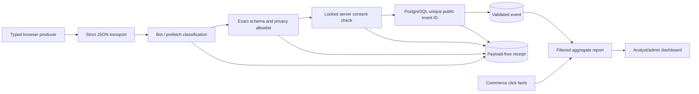

# UNSOLERO analytics architecture

Status: first-party repository implementation  
Policy version: `analytics-v1`

UNSOLERO uses a small typed event pipeline. It does not embed a third-party
analytics SDK. Optional product analytics is separate from merchant attribution,
security auditing, operational logs, and deterministic recommendations.

## Event taxonomy

| Event | Exact properties | Author |
|---|---|---|
| `page_view` | none | Browser |
| `onboarding_started` | `onboarding_id` UUID | Browser |
| `onboarding_completed` | `onboarding_id` UUID; outcome enum | Browser |
| `recommendation_generated` | status enum; persistence enum | Browser |
| `product_viewed` | `product_id` UUID | Browser |
| `product_saved` | `product_id` UUID; persistence enum | Browser |
| `comparison_created` | product count 2–4; persistence enum | Browser |
| `setup_saved` | `setup_id` UUID; persistence enum | Browser |
| `affiliate_clicked` | bounded offer/product/source/campaign subset | Server only, after a countable recorded redirect |

Browser envelopes require a UUID `event_id`, UUID `session_id`, bounded
`surface`, current `consent_version`, exact properties, and optional safe
context. `page_path` excludes query/fragment; attribution values are bounded
tokens; referrer is hostname only. Occurrence time, identity, reportability,
schema version, and retention expiry are server-authored.

## Pipeline

`received` is a payload-free receipt, not a business fact. Outcomes are
`accepted`, `rejected`, `privacy_filtered`, `bot_filtered`, and `deduplicated`.
Only `analytics.events.is_reportable=true` enters product-event metrics. Click
metrics use `commerce.affiliate_clicks.is_countable=true`. Conversion/revenue
metrics require verified, reconciled Phase 4 data and are never inferred.

The unique `public_event_id` database constraint handles retries and concurrent
duplicates. A duplicate returns the same empty success surface as acceptance;
there is no read-by-ID endpoint. The internal server UUID remains authoritative.

## Consent

- No record means `unknown`; optional events fail closed.
- `PUT /api/analytics/consent` stores `granted` or an initial `denied` decision.
- Declining after a grant records `withdrawn`; it does not rewrite history or
  claim deletion completed.
- Every decision records the policy version, safe source, and server time.
- The browser cache controls presentation only. Ingestion locks and verifies
  current server state and policy version in the same transaction as insertion.
- A new policy version requires a new explicit valid decision. Old-version
  event envelopes are rejected.

## Reporting semantics

`GET /api/admin/analytics` defaults to 30 days; `from`/`to` are RFC3339, the
maximum range is 366 days, and ranking `limit` is 1–50. Reports identify:

- layer: `validated_filtered`;
- coverage: `complete` or `partial` against the v3 coverage checkpoint;
- state: `no_data`, `insufficient_data`, or `available`;
- minimum rate sample: 20 eligible observations;
- receipt outcome counts separately from business metrics.

Rates are `null` below the sample threshold or without a denominator. The UI
renders “No data” or “Insufficient data,” never an invented zero percentage.
Historical v1/v2 event rows are non-reportable because current server consent
cannot be proven. Countable affiliate clicks remain commerce facts.

### Campaign attribution

The report carries three attribution sections built from the UTM values the
browser captures on first touch (`utm_source` → `traffic_source`,
`utm_medium` → `traffic_medium`, `utm_campaign` → `campaign`). Each respects
`is_reportable`, the window, and `limit` like the other rankings:

- `campaigns`: per (`campaign`, `traffic_source`, `traffic_medium`) —
  `sessions` and `page_views` from reportable `page_view` events, and
  `affiliate_clicks` from reportable `affiliate_clicked` events whose stored
  `campaign`, `traffic_source`, and `traffic_medium` columns match. The
  merchant redirect writes those columns on the event itself (and repeats
  `campaign` inside `properties`); the columns are the grouping key.
- `landing_pages`: per (`campaign`, `page_path`) — the first campaign-bearing
  reportable `page_view` of each session. The browser repeats first-touch
  attribution on every later event in the tab session, so this is where the
  link landed; a session that opened the site directly and followed a campaign
  link later is attributed to that later landing.
- `sources_by_medium`: sessions per (`traffic_source`, `traffic_medium`), so
  `youtube/shorts` and `youtube/video` separate.

Consent shapes these numbers. Under the current policy an anonymous
first-time visitor's `page_view` is not stored at all: the browser sends
nothing until the visitor accepts analytics in the banner or the footer
preferences, and the server rejects any event without a persisted `granted`
decision for the current policy version (`consent_required`). No record means
`unknown`, and `unknown` fails closed. `affiliate_clicked` is different: it is
server-authored from the merchant redirect with `consent_state=essential`, is
reportable whenever the click is countable, and the redirect URL carries the
browser's stored attribution regardless of consent. So campaign sessions, page
views, and landing pages measure only the consenting share of social traffic,
while campaign affiliate clicks measure every human click. A campaign can
legitimately show clicks with zero sessions, and sessions are a floor on
visitors, not a count. Changing that is a consent-policy decision, not a
reporting one.

What the browser does remember before consent, since 2026-09-02, is the
landing attribution itself: `captureLandingAttribution()` runs once at
start-up and stores the three bounded UTM tokens and the referring hostname in
`sessionStorage`, exactly what `parseAttribution` admits and nothing else. No
identifier is minted — the session id is created only when an event is sent or
a vendor link is built — and no page view is recorded. It exists so a visitor
who arrives from a video, accepts nothing, moves around the site and then
clicks a vendor button is attributed to the campaign that brought them, which
is the one number this site can report about a campaign for every visitor.
The decision (owner, 2026-09-02): UTM tokens and a referrer hostname are not
personal data, and storing them for the tab session does not change what the
consent banner governs.

## Access

| Surface | Allowed role |
|---|---|
| Own current consent | Anonymous browser subject or authenticated account |
| Account exportable events/consent history | Authenticated owner |
| Aggregate validated analytics | Analyst, administrator |
| Event-level validated records | Administrator only |
| Payload-free receipt aggregates | Analyst, administrator |
| Commerce click/conversion reports | Commerce operator, administrator; analyst gets read-only aggregate commerce access where routed |
| Security events | Administrator/security operations only; no analytics route |

Backend permission middleware is authoritative. Frontend navigation hiding is
only a usability aid.

## Provider extension

An external exporter may implement an analytics-owned port later. It must
receive only validated allowlisted records, honor consent/withdrawal/retention,
pass contractual/privacy review, and never become a recommendation input. No
provider or write key is configured now.

