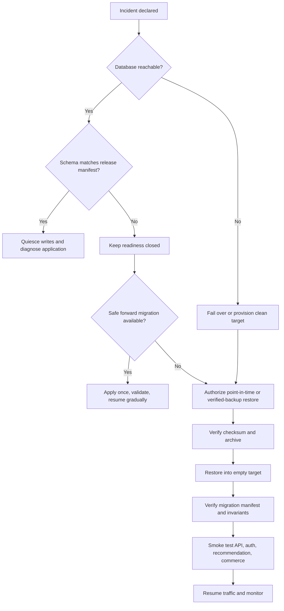

# UNSOLERO disaster recovery validation

Status: local logical restore verified; production disaster recovery blocked

## 2026-08-18 Phase 11 local drill

The production-shaped local staging database created
`unsolero-phase11-validation.dump`, verified its archive, checksum, and ordered
migration fingerprint, and recorded an operational checkpoint. A separate
Compose project provisioned a clean PostgreSQL volume and restored the archive,
verifying all 19 migrations. The original staging database was not overwritten.

Controlled PostgreSQL loss changed readiness to 503; the catalog returned a
generic server failure without data and readiness recovered to 200 after the
database restarted. Redis and MinIO loss also produced 503 readiness and
recovered to 200. This does not prove HA failover, PITR, off-site retention,
KMS, production RPO/RTO, or operator paging.

## 2026-08-17 local drills

The non-root backup tool created a PostgreSQL custom-format archive atomically,
validated it with `pg_restore --list`, and wrote SHA-256 and migration metadata.
The backup command completed in 3.42 seconds. Restoration into a clean isolated
PostgreSQL 17 target completed and verified all 17 migrations in 3.92 seconds,
excluding target provisioning and application smoke checks.

The later Phase 9 drill additionally bound metadata to the ordered
version/name/checksum migration-manifest fingerprint. Backup
`unsolero-phase9-verified` restored into a fresh PostgreSQL 17 target and
verified all 17 migrations; a second restore into the populated target was
rejected with exit code `4`. The first attempt exposed a wrong migration-ledger
column name and shell-pipeline error masking. Both defects were fixed before the
verified rerun. Phase 8 timings above are not reclassified as Phase 9 timings.

Post-restore schema validation accepted the current embedded release manifest
and rejected manifests with a changed checksum or missing migration. The
restore tool also:

- rejected a deliberately truncated disposable backup copy with exit 1 before
  touching the database;
- rejected a second restore into the non-empty target with exit 4;
- preserved the original verified archive while the corrupt probe was removed;
- restored only provider-verified and user/application facts actually present
  at the backup point—no synthetic revenue was introduced.

The application failure drill stopped only the isolated PostgreSQL container.
API liveness remained 200, readiness returned 503 after its two-second bounded
dependency timeout, and readiness returned 200 after PostgreSQL restarted. A
reversible incompatible migration record likewise changed readiness from 200
to 503 and back to 200 after removal.

These measurements are local recovery mechanics, not achieved production RPO
or RTO. A logical archive has an RPO equal to its creation point; writes after
that point are absent. A production RPO requires scheduled durable backups or
PITR. The initial four-hour RTO and 24-hour RPO remain objectives only.

## Recovery decision tree

## Required production controls

1. Automated encrypted backups in a separate account/region with deletion
   protection and alerting.
2. Database-native point-in-time recovery, replication/failover testing, and a
   documented maximum acceptable data-loss window.
3. Quarterly restore drills from production-shaped data, with named incident
   commander, database owner, security owner, and business approver.
4. Restore-time secret access through the deployment secret manager, never
   checked-in `.env` values.
5. Post-restore checks for migration checksums, row-count invariants, immutable
   evidence/conversion facts, recommendation reproducibility, account access,
   retention jobs, and merchant provider state.
6. Legal/privacy guidance for reconciling deletion requests and retention
   obligations after restoring older data.

Never overwrite a live database with `pg_restore`, edit migration history, or
delete a corrupt primary before a verified recovery copy and incident approval
exist. [`BACKUP_RESTORE.md`](./BACKUP_RESTORE.md) contains operator commands.
