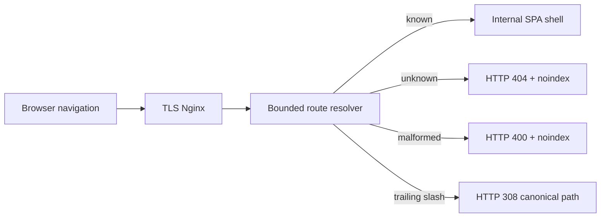

# Public routing and indexability

Status: local TLS edge semantics verified; server-rendered page content is not implemented  
Last reviewed: 2026-08-18

UNSOLERO uses a bounded edge route resolver rather than a general SSR system.
Nginx proxies browser navigation to `GET /api/v1/public-route` with the original
URI. The resolver validates the static manifest or performs a bounded database
lookup for product, category, brand, and editorial slugs. Only a known route is
internally redirected to the React shell.

`/api/`, `/assets/`, `/images/`, `/sitemap.xml`, and `/robots.txt` have explicit
locations and cannot fall through to the application shell.

## Index policy

Indexable without a query string:

- `/`, `/products`;
- existing `/products/:slug`, `/categories/:slug`, `/brands/:slug`;
- `/guides`, `/articles` and published matching editorial detail paths.

Served with `X-Robots-Tag: noindex, nofollow`:

- authentication, onboarding/build, comparison, wishlist, setup, and account
  routes;
- every admin route;
- any otherwise-public route with query parameters;
- all resolver error responses.

Known indexable routes emit an HTTP canonical `Link` header. Trailing slash
variants redirect with 308. Encoded slash/backslash, control characters,
double slashes, and dot segments fail with 400. Unknown static/dynamic slugs
return a genuine 404 while retaining the existing React not-found experience.

The sitemap remains database-generated from published public records and
`robots.txt` points to the configured canonical origin. Private routes are not
added to the sitemap.

Phase 11 verified these semantics through handler tests and actual HTTPS edge
requests. The result fixes false-200 unknown routes but does not make client-
rendered catalog/editorial content equivalent to SSR or prerendering. Search
rendering, rich-result eligibility, and crawler behavior remain external SEO
validation work.
